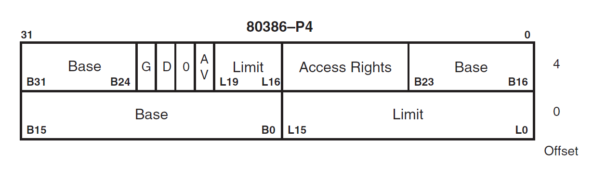

# LightOS Dev Record

LightOS 操作系统开发日志

---

指导 @踌躇月光：https://www.bilibili.com/video/BV1Wr4y1i7kq/。

---

## 大道至简，殊途同归

## Great Minds Think Alike

---

# 常见 BUG 与处理记录

## VSCode相关

* 代码格式化时，大括号不换行：setting 中搜索 C_Cpp.clang_format_style，设置为：{ BasedOnStyle: Chromium, IndentWidth: 4}

## 头文件链接时重复定义

在C/C++编程中，使用`#ifndef`、`#define`和`#endif`来防止头文件被多次包含是一个常见的做法。这被称为“include guard”。`#pragma once`也可以实现相同的效果。这些技术能够防止编译期间的重复定义错误，但它们不能防止链接期间的重复定义错误。

因此.h中只能使用函数声明与extern变量声明，并在.c中实现。并且，有时仅修改头文件并不会应用构建，遇到奇怪bug可以先尝试 clean 重新构建。

## PF 页错误

设计中，0 地址并未映射，这样可以对空指针访问进行排查。

如果代码运行突然出现PF，估计就是访问了空指针。

## GP General Protection 错误

爆栈，可能是 esp = 0 后 push。

## 头文件相互引用

若两个头文件相互引用，就算定义了 \#pragma once 或者 ifndef 的引入控制，也会导致引入失败。此时需要确保单向引用，考虑引用来源一般是结构体指针定义，因此结构体定义需要向前声明，即增加 struct 标注。

例如，在 fs 中定义了 inode，并通过cache、mutex多层引用到了task。而task结构体却定义了inode的指针，导致互相引用的问题，编译报错在fs定义的inode等结构体中找不到cache_t的结构体。解决方法就是去掉task对fs的引用，在定义task_t 时，使用 struct 定义 inode 节点。

所以习惯性使用 struct 定义可以防止头文件互相包含的问题。

# 开发准备

环境配置

* WSL + Bochs + vsCode

### bochs安装需要图形化界面
    apt install bochs
    apt install bochs-x
    安装XLaunch
    设置~/.bash中DISPLAY=localhost:0.0
    使用xclocks测试成功

补充，在wsl2中由于网络走的net映射，因此在wsl2中配置如下：
[教程](https://aalonso.dev/blog/how-to-use-gui-apps-in-wsl2-forwarding-x-server-cdj)
在WSL2的 ~/.bashrc或 ~/.zshrc文件中添加
`export DISPLAY=172.30.160.1:0.0`（换成windows中wsl网卡ip）
或者自动获取`export DISPLAY=$(ip route|awk '/^default/{print $3}'):0.0`
注意一定要打开防火墙通信请求（控制面板\系统和安全\Windows Defender 防火墙\允许的应用，VcXsrv的私有网络访问）

---

### 汇编
`nasm -f bin boot.asm -o boot.bin`

- **nasm**: 这是命令行上调用NASM汇编器的方式。NASM用于将汇编语言源代码转换成机器语言代码。
- **-f bin**: 这个选项指定了输出文件的格式。在这个例子中，`-f bin`告诉NASM生成一个纯二进制格式的文件（binary format）。这种格式没有任何元数据或重定位信息，直接映射到内存中就可以执行，非常适合用作引导扇区或其他需要直接硬件级别访问的场合。
- **boot.asm**: 这是输入文件的名称，即包含汇编源代码的文件。在这个例子中，`boot.asm`很可能包含了一个操作系统的引导加载程序的代码。
- **-o boot.bin**: 这个选项指定了输出文件的名称。在这里，`-o boot.bin`命令告诉NASM将编译后的二进制结果保存为`boot.bin`。这个文件包含了编译后的机器代码，可以被写入磁盘的引导扇区或用于其他直接执行的环境。

### 生成硬盘镜像文件

`bximage -q -hd=16 -mode=create -sectsize=512 -imgmode=flat LightOS.img`

​	`bximage`是Bochs虚拟机附带的一个工具，用于创建虚拟硬盘镜像文件。这个命令行工具特别有用于准备虚拟环境，比如操作系统开发时用于模拟真实的硬件环境。让我们逐一解释你提供的命令中的各个参数：

- **-q**: 这个参数代表“quiet”模式，意味着`bximage`在执行时会减少输出的信息量，只显示最关键的信息，或者可能根本不显示任何东西，除非发生错误。
- **-hd=16**: 这个参数指定创建的虚拟硬盘大小为16MB。`-hd`选项用于定义硬盘的大小，后面跟的数字代表硬盘的容量，单位为MB。
- **-mode=create**: 这个参数指明`bximage`的操作模式为“创建”模式。这意味着命令的目的是创建一个新的镜像文件，而不是修改或检查一个现有的镜像。
- **-sectsize=512**: 这个参数设置每个扇区（sector）的大小为512字节。扇区是硬盘存储的基本单位，512字节是最常见的扇区大小，尽管现代硬盘可能使用更大的扇区尺寸，如4096字节。
- **-imgmode=flat**: 这个参数指定镜像文件的模式为“flat”模式，意味着创建的是一个平坦的镜像文件，没有分区表或任何复杂结构。这种模式特别适合于简单的操作系统引导或其他需要直接访问硬盘的场合。
- **LightOS.img**: 这是要创建的虚拟硬盘镜像文件的名称。在这个例子中，文件名被指定为`LightOS.img`。这个文件会根据前面的参数配置被创建。

### 将编译好的内核镜像写入硬盘镜像文件

`dd if=boot.bin of=LightOS.img bs=512 count=1 conv=notrunc`

- **bs=512**: `bs`代表块大小（block size）。这里设置为512字节，意味着`dd`在处理数据时会以512字节为单位进行读取和写入操作。这个大小通常与硬盘的扇区大小相匹配，特别是对于MBR（主引导记录）或其他引导扇区来说，512字节是标准的扇区大小。
- **count=1**: `count`指定要复制的块数量。这里设置为1，表示只复制1个块，即512字节的数据从`boot.bin`到`master.img`。这通常用于写入单个引导扇区，因为一个标准的引导扇区大小就是512字节。
- **conv=notrunc**: `conv`（convert的缩写）用于指定转换选项。`notrunc`意味着不截断输出文件，也就是说，`dd`不会在写入数据后截断`master.img`文件。这是重要的，特别是当你只想修改`master.img`中的特定部分而不影响文件其余部分时。如果没有这个选项，`dd`可能会将`master.img`的大小修改为仅包含写入的数据大小。

### 启动 bochs
`bochs -q`可以使用默认配置自动启动，但是首次启动需要手动需改配置，先不使用-q跳过，选择4来保存一份配置，名称必须为bochsrc，否则无法默认指定
修改内容如下：
display_library: x, options="gui_debug"
ata0-master: type=disk, path="LightOS.img", mode=flat
之后就可以顺利通过bochs -q启动界面与debug界面了。

## 一些知识点

* gdb 打印栈：`-exec display/16xw $sp`，16为打印数。
* DWARF：调试信息（debugging information），用于调试，获得调试异常
* CFI也就是控制流完整性，gcc编译成汇编时会自动添加开头部分的伪指令
* 硬盘类型，以及为什么选择IDE启动？

## Makefile

为了自动化编译内核，需要使用make
```
boot.bin: boot.asm
    nasm -f bin boot.asm -o boot.bin
LightOS.img: boot.bin
    yes | bximage -q -hd=16 -mode=create -sectsize=512 -imgmode=flat LightOS.img # 将yes直接输入到bximage命令中，让其自动更新覆盖原来的镜像文件
    dd if=boot.bin of=LightOS.img bs=512 count=1 conv=notrunc
```

# Boot

boot.asm -> loader.asm -> head.asm (ld) kernel

## 硬盘读写

- CHS 模式 / Cylinder / Head / Sector
- LBA 模式 / Logical Block Address

LBA28，总共能访问 128G 的磁盘空间；

硬盘控制端口

| Primary 通道            | Secondary 通道 | in 操作      | out 操作     |
| ----------------------- | -------------- | ------------ | ------------ |
| 0x1F0                   | 0x170          | Data         | Data         |
| 0x1F1                   | 0x171          | Error        | Features     |
| 0x1F2                   | 0x172          | Sector count | Sector count |
| 0x1F3                   | 0x173          | LBA low      | LBA low      |
| 0x1F4                   | 0x174          | LBA mid      | LBA mid      |
| 0x1F5                   | 0x175          | LBA high     | LBA high     |
| 0x1F6                   | 0x176          | Device       | Device       |
| 0x1F7                   | 0x177          | Status       | Command      |

- 0x1F0：16bit 端口，用于读写数据
- 0x1F1：检测前一个指令的错误
- 0x1F2：读写扇区的数量
- 0x1F3：起始扇区的 0 ~ 7 位
- 0x1F4：起始扇区的 8 ~ 15 位
- 0x1F5：起始扇区的 16 ~ 23 位
- 0x1F6:
    - 0 ~ 3：起始扇区的 24 ~ 27 位
    - 4: 0 主盘, 1 从片
    - 6: 0 CHS, 1 LBA
    - 5 ~ 7：固定为1
- 0x1F7: out
    - 0xEC: 识别硬盘
    - 0x20: 读硬盘
    - 0x30: 写硬盘
- 0x1F7: in / 8bit
    - 0 ERR
    - 3 DRQ 数据准备完毕
    - 7 BSY 硬盘繁忙

## 实模式的内存布局

| 起始地址  | 结束地址  | 大小     | 用途               |
| --------- | --------- | -------- | ------------------ |
| `0x000`   | `0x3FF`   | 1KB      | 中断向量表         |
| `0x400`   | `0x4FF`   | 256B     | BIOS 数据区        |
| `0x500`   | `0x7BFF`  | 29.75 KB | 可用区域           |
| `0x7C00`  | `0x7DFF`  | 512B     | MBR 加载区域       |
| `0x7E00`  | `0x9FBFF` | 607.6KB  | 可用区域           |
| `0x9FC00` | `0x9FFFF` | 1KB      | 扩展 BIOS 数据区   |
| `0xA0000` | `0xAFFFF` | 64KB     | 用于彩色显示适配器 |
| `0xB0000` | `0xB7FFF` | 32KB     | 用于黑白显示适配器 |
| `0xB8000` | `0xBFFFF` | 32KB     | 用于文本显示适配器 |
| `0xC0000` | `0xC7FFF` | 32KB     | 显示适配器 BIOS    |
| `0xC8000` | `0xEFFFF` | 160KB    | 映射内存           |
| `0xF0000` | `0xFFFEF` | 64KB-16B | 系统 BIOS          |
| `0xFFFF0` | `0xFFFFF` | 16B      | 系统 BIOS 入口地址 |

## 内存检测

大概意思是说，操作系统在内存检测之前是无法使用内存的，因此需要调用bios中断实现内存检测获取信息，不知道这个“必须检测”是由于硬件限制还是缺乏内存信息的限制。

参考文献 https://wiki.osdev.org/Detecting_Memory_(x86)

BIOS 0x15 子功能号eax=0xe820
核心就是 bios 中断交互，没啥需要注意的，具体手册可查

## 保护模式

### 全局描述符
* 全局描述符表 GDT

  


```c
typedef struct descriptor /* 共 8 个字节 */
{
    unsigned short limit_low;      // 段界限 0 ~ 15 位
    unsigned int base_low : 24;    // 基地址 0 ~ 23 位 16M
    unsigned char type : 4;        // 段类型
    unsigned char segment : 1;     // 1 表示代码段或数据段，0 表示系统段
    unsigned char DPL : 2;         // Descriptor Privilege Level 描述符特权等级 0 ~ 3
    unsigned char present : 1;     // 存在位，1 在内存中，0 在磁盘上
    unsigned char limit_high : 4;  // 段界限 16 ~ 19;
    unsigned char available : 1;   // 该安排的都安排了，送给操作系统吧
    unsigned char long_mode : 1;   // 64 位扩展标志
    unsigned char big : 1;         // 32 位 还是 16 位;
    unsigned char granularity : 1; // 粒度 4KB 或 1B
    unsigned char base_high;       // 基地址 24 ~ 31 位
} __attribute__((packed)) descriptor;
```

> **type segment = 1**
>
> | X | C/E | R/W | A |
>
> A: Accessed 是否被 CPU 访问过
>
> X: 1/代码 0/数据
>
> X = 1：代码段
>
> * C: 是否是依从代码段
> * R: 是否可读
>
> X = 0: 数据段
>
> * E: 0 向上扩展 / 1 向下扩展
>
> * W: 是否可写

### 段选择子

- 只需要一个代码段
- 需要一个或多个数据段 / 栈段 / 数据段
- 加载到段寄存器中 / 校验特权级

```cpp
typedef struct selector
{
    unsigned char RPL : 2; // Request PL 
    unsigned char TI : 1; // 0  全局描述符 1 局部描述符 LDT Local 
    unsigned short index : 13; // 全局描述符表索引
} __attribute__((packed)) selector;
```

- cs / ds / es / ss
- fs / gs

### 开启保护模式

为了向前兼容实模式应用，默认 A20 不开启。兼容性是设计上的重大包袱。最早的8086处理器有20条地址线（A0-A19），能够访问1MB的内存地址空间（2^20 = 1MB），不开启 A20 则会导致超过20位的地址被忽略，并使得地址卷绕，即 0x100000=0x0，这就是为了兼容性。开启 A20 后才能访问超过 1M 的内存。

* 实模式 段地址 * 16 + 段偏移 大于 1M，可通过地址回绕确认开启保护模式
* 0x92 端口第二位置 1 即可开启 A20
* cr0 寄存器 0 位 置为 1 即可开启保护模式

保护模式特性：

- **特权级别（PL）**：开启了多级特权机制，增强了内存和资源的保护。
- **地址寻址方式**：从实模式的段：偏移地址转换为基于GDT/LDT的段选择子和段描述符管理。
- **分页机制（可选）**：在保护模式下，可以启用分页机制，实现更高级的内存管理。

# 进入内核

这个内核不会超过100k，理论上需要寻找内存空间可用地址，实际上bios中断、引导mbr等内容都不重要了，但 BIOS 数据区在系统启动时由 BIOS 初始化，它包含各种硬件和系统状态信息。我先将其256字节拷贝到0x90000位置待用，这个位置基本处于可用内存大块的末尾（`0x7E00`-`0x9FBFF`）。（内核不超过100k即0x19000，之后有用再说）

> #### BIOS 数据区内容
>
> - 0x400 - 0x4FF（256字节）
>
>   ：存储了以下信息：
>
>   - **0x400 - 0x40F**：COM1 - COM4 基地址
>   - **0x410 - 0x417**：LPT1 - LPT3 基地址
>   - **0x418 - 0x41F**：EBDA（扩展 BIOS 数据区）地址
>   - **0x420 - 0x433**：硬盘控制器数据
>   - **0x440 - 0x44F**：硬盘参数表
>   - **0x450 - 0x45F**：键盘缓冲区头和尾指针
>   - **0x460 - 0x46F**：显示模式参数
>   - **0x470 - 0x4FF**：其他系统状态和硬件信息

先将内核在实模式加载到0x10000，为了不覆盖bios中断，后面的loader需要使用他进行内存检测和print的功能，之后，在bios使用完成后使用实模式将0x10000移动到0x0，不能在保护模式的原因是，如果仿照onix在loader中写一个跳转刷新保护模式的jmp，需要重写一个0x90200的gdt，很麻烦也不精美。

拷贝过程需要注意实模式仅仅支持0xffff数量级的读取，因此单次不超过128块扇区，分两次拷贝。

很多指令隐含了ds寄存器，因此移动到0x90000开始的内存后，需要注意修改ds使其指向正确。没办法实模式就是需要偏移才能算出地址，很麻烦。

最后卡在了 jmp 8:0 的位置，lgdt 可能出现了问题，加载不到0x90200偏移的gdt，不知道为什么，而且debug查gdt就会卡死。现象是一旦会跳到0xfffffff0位置，这个应该是bochs的入口，应该是跳到了奇怪的地址导致崩溃重启了。

后来想了想不要当完美主义者，学习原理为主，这种属于汇编和体系结构硬伤，没必要死磕，最终放弃了学linux 0.11的0x90000内存布局的想法，跟着onix走就行了。bug代码保存了一份，放在了`dev_bug_rec/lgdt-0x90200，jmp 8,0 跳转失败.zip`

## ELF

https://refspecs.linuxfoundation.org/elf/elf.pdf

## 整理（目录、makefile、bochs-gdb调试）

新增了boot、kernel、include两个目录，主要是修改makefile中的 src、build等目录，以及在编译kernel时要注意关闭编译器默认的引入，如关闭pie、不引入标准头标准库、-m32指定32位程序等。

### bochs-gdb调试配置

从https://sourceforge.net/projects/bochs/files/bochs/2.8/ 下载bochs-2.8源码，或者github release 2.8中bochs文件夹也可以。

bochs调试有两种，一种自带的debugger，另一种是gdb远程，而两者不共存，因此可以编译两份，放在不同目录，我应该是wsl2直接安装了bochs，导致默认配置了自带的debugger而无法使用gdb远程，因此重新编译一份，参考https://zhuanlan.zhihu.com/p/492780020，并且参考archlinux的pkgbuild安装文件的configure，内容如下

```shell
./configure \
        --prefix=/xxxxxx \
        --without-wx \
        --with-x11 \
        --with-x \
        --with-term \
        --disable-docbook \
        --enable-cpu-level=6 \
        --enable-fpu \
        --enable-3dnow \
        --enable-disasm \
        --enable-long-phy-address \
        --enable-disasm \
        --enable-pcidev \
        --enable-usb \
        --with-sdl \
        --enable-all-optimizations \
        --enable-gdb-stub \
        --with-nogui
        
./configure --prefix=/mnt/e/markdown/OpreatingSystem/LightOS/bochs-2.7/gdb --without-wx --with-x11 --with-x --with-term --disable-docbook --enable-cpu-level=6 --enable-fpu --enable-3dnow --enable-disasm --enable-long-phy-address --enable-disasm --enable-pcidev --enable-usb --with-sdl --enable-all-optimizations --enable-gdb-stub --with-nogui

# 上面的执行后没有Makefile，又参考知乎的写了下面的，重点看了gdb相关，其他的没管，，，

./configure --with-x11 --with-wx --enable-disasm --enable-all-optimizations --enable-readline --enable-long-phy-address --enable-ltdl-install --enable-idle-hack --enable-plugins --enable-a20-pin --enable-x86-64 --enable-cpu-level=6 --enable-large-ramfile --enable-repeat-speedups --enable-fast-function-calls  --enable-handlers-chaining  --enable-trace-linking --enable-configurable-msrs --enable-show-ips  --enable-debugger-gui --enable-iodebug --enable-logging --enable-assert-checks --enable-fpu --enable-vmx=2 --enable-svm --enable-3dnow --enable-alignment-check  --enable-monitor-mwait --enable-avx  --enable-evex --enable-x86-debugger --enable-pci --enable-usb --enable-voodoo -enable-gdb-stub --prefix=/mnt/e/markdown/OpreatingSystem/LightOS/bochs-2.8/bochs-gdb

# 编译
make -j 6

# 其中找不到 x11的头文件
sudo apt install libx11-dev

sudo make install
```

之后一定要注意这里踩坑了，包括视频本身，应该**都是在linux中远程连接开发的**，也就是利用vscode的ssh远程开发功能，所以可以通过本地的 gdb 进行远程调试（类似 gdb +gdbserver实现的，估计是gdbserver 被bochs gdb 集成了）。下面是vscode 中的 launch.json

```json
{
    "version": "0.2.0",
    "configurations": [
      {
        "name": "WSL2 GDB 调试",
        "type": "cppdbg",
        "request": "launch",
        "program": "${workspaceFolder}/build/kernel.bin", //kernel.bin
        "args": [],
        "stopAtEntry": false,
        "cwd": "${workspaceFolder}",
        "environment": [],
        "externalConsole": false,
        "MIMode": "gdb",
        "setupCommands": [
          {
            "description": "Enable pretty-printing for gdb",
            "text": "-enable-pretty-printing",
            "ignoreFailures": true
          }
        ],
        "miDebuggerServerAddress": "172.30.162.247:1234",
        "miDebuggerPath": "/usr/bin/gdb"
      }
    ]
  }
```

但是遇到了两个问题，第一个，bochs终端连接gdb时会疯狂输出地址，从高到低一直到起始位置，基本要输出好几分钟，这期间什么也不能干。

第二个问题，等待输出之后，发现无法运行到断点。

用up的configure重新编译一下gdb，其中根据评论区，重新下载bochs2.7，并且补全了依赖

```sh
sudo apt-get install libncurses5-dev libncursesw5-dev
sudo apt-get install libsdl1.2-dev
```

之后同样的configure就会生成Makefile了

```ini
./configure --prefix=/mnt/e/markdown/OpreatingSystem/LightOS/bochs-2.7/bochs-gdb --without-wx --with-x11 --with-x --with-term --disable-docbook --enable-cpu-level=6 --enable-fpu --enable-3dnow --enable-disasm --enable-long-phy-address --enable-disasm --enable-pcidev --enable-usb --with-sdl --enable-all-optimizations --enable-gdb-stub --with-nogui

# 后续make报错，缺少gui，‘XRRQueryExtension’ was not declared
sudo apt-get install libxrandr-dev
# 无效，尝试gpt的禁用 XRandR 的方案

./configure --prefix=/mnt/e/markdown/OpreatingSystem/LightOS/bochs-2.7/bochs-gdb --without-wx --with-x11 --with-x --with-term --disable-docbook --enable-cpu-level=6 --enable-fpu --enable-3dnow --enable-disasm --enable-long-phy-address --enable-disasm --enable-pcidev --enable-usb --with-sdl --enable-all-optimizations --enable-gdb-stub --with-nogui --disable-xrandr
 
# 不过configure识别不了 --enable-disasm --disable-xrandr，但是这次 make 居然就成了？之后重试上面的也可以了。玄学。
# 问题很多，运行又出现了 >>PANIC<< Plugin 'gameport' not found的问题，configure + --enable-gameport 之后又出现了 >>PANIC<< Plugin 'iodebug' not found的问题，感觉不对劲，从头思考一下。

# 尝试 上面知乎给的 configure + bochs 2.6.11
./configure --with-x11 --with-wx --enable-disasm --enable-all-optimizations --enable-readline --enable-long-phy-address --enable-ltdl-install --enable-idle-hack --enable-plugins --enable-a20-pin --enable-x86-64 --enable-cpu-level=6 --enable-large-ramfile --enable-repeat-speedups --enable-fast-function-calls  --enable-handlers-chaining  --enable-trace-linking --enable-configurable-msrs --enable-show-ips  --enable-debugger-gui --enable-iodebug --enable-logging --enable-assert-checks --enable-fpu --enable-vmx=2 --enable-svm --enable-3dnow --enable-alignment-check  --enable-monitor-mwait --enable-avx  --enable-evex --enable-x86-debugger --enable-pci --enable-usb --enable-voodoo -enable-gdb-stub --prefix=/mnt/e/markdown/OpreatingSystem/LightOS/bochs-2.6.11/bochs-gdb

./configure --with-x11 --with-wx --enable-disasm --enable-all-optimizations --enable-readline --enable-long-phy-address --enable-ltdl-install --enable-idle-hack --enable-plugins --enable-a20-pin --enable-x86-64 --enable-cpu-level=6 --enable-large-ramfile --enable-repeat-speedups --enable-fast-function-calls  --enable-handlers-chaining  --enable-trace-linking --enable-configurable-msrs --enable-show-ips  --enable-debugger-gui --enable-iodebug --enable-logging --enable-assert-checks --enable-fpu --enable-vmx=2 --enable-svm --enable-3dnow --enable-alignment-check  --enable-monitor-mwait --enable-avx  --enable-evex --enable-x86-debugger --enable-pci --enable-usb --enable-voodoo -enable-gdb-stub --prefix=/mnt/e/markdown/OpreatingSystem/LightOS/bochs-2.8/bochs-gdb

还是报错，有的无法编译，有的编译好了没法运行，也有的运行之后报错gameport插件
```

### 失败

配不好了，用2.8测了，同样的configure编译出来的bochs不一样，用bochs生成的配置文件不匹配，后编译的没有debug-stub，如果用后来编译出来的bochs强行运行之前的配置会报缺少iodebug插件，看来是configure编译出来的bochs不一样。

### 新的环境配置

问了lyq之后考虑放弃bochs，采用vmware+ubuntu+qemu的开发测试环境。首先ubuntu开启远程ssh。注，vscode将在2025取消对老内核的远程连接支持，所以ubuntu需要 >= 20.04

```bash
sudo apt update
sudo apt install openssh-server
sudo gedit /etc/ssh/sshd_config
# 将PermitRootLogin prohibit-password那一行修改为PermitRootLogin yes，去掉前面的#号
# 将port 22前面的#去掉3

sudo systemctl restart ssh
```

ubuntu 安装 qemu

```bash
sudo apt install qemu
# 16.04会自动安装一些工具，如qemu-utils下的qemu-image
# 22.04不安装，手动安装工具
sudo apt-get install qemu-system-mips
sudo apt-get install qemu-user
sudo apt-get install qemu-utils
```

共享文件夹：https://blog.csdn.net/weixin_51111267/article/details/132343320

```bash
#首先在vmware设置中添加共享文件夹

# 末尾添加映射
chmod 777 /etc/fstab
.host:/ /mnt/hgfs fuse.vmhgfs-fuse allow_other,uid=0,gid=0,umask=022 0 0

# 链接
ln -s /mnt/hgfs/LightOS ~/Desktop
```

---

后面干了挺多东西，比如添加git，创建vmware虚拟机，这些对应p16。其中vscode 的 git ui 中 commit 会报错没有username 和 email，命令行就好了。还有一个坑就是，vmware创建虚拟机时候的最后一步指定了已经存在的镜像文件后，需要“转换镜像格式”，否则会boot error，评论区说可能是55aa的问题。

## 端口输入输出

端口就是外部设备的内部寄存器编号。显示相关的端口：

```cpp
#define CRT_ADDR_REG 0X3D4
#define CRT_DATA_REG 0X3D5
#define CRT_CURSOR_H 0XE
#define CRT_CURSOR_L 0XF
# 一个是地址寄存器，一个是数据寄存器
# 读取：首先将需要读取的值（CURSOR_H/L）写入CRT_ADDR_REG也就是显示端口，之后读端口的数据寄存器（记得延迟一会再返回）
void read_cursor(){
    outb(CRT_ADDR_REG, CRT_CURSOR_H);
    u16 pos = inb(CRT_DATA_REG) <<8;
    outb(CRT_ADDR_REG, CRT_CURSOR_L);
    pos |= inb(CRT_DATA_REG);
}
#写入同理
void write_cursor(){
	outb(CRT_ADDR_REG, CRT_CURSOR_H);
    outb(CRT_DATA_REG, 0);
    outb(CRT_ADDR_REG, CRT_CURSOR_L);
    outb(CRT_DATA_REG, 0);
}
```

## 字符串处理

https://en.cppreference.com/w/c/string/byte

## 显卡驱动

- CGA (Color Graphics Adapter)
    - 图形模式
        - 160 * 100
        - 320 * 240
        - 640 * 200
    - 文本模式
        - 40 * 25
        - 80 * 25
- EGA (Enhanced Graphics Adapter)
- MCGA (Multi Color Graphics Array)

### CRTC (Cathode Ray Tube Controller)

CGA 使用的 MC6845 芯片；

- CRT 地址寄存器 0x3D4
- CRT 数据寄存器 0x3D5
- CRT 光标位置 - 高位 0xE
- CRT 光标位置 - 低位 0xF
- CRT 显示开始位置 - 高位 0xC
- CRT 显示开始位置 - 低位 0xD

控制字符参考 onix 笔记 022 基础显卡驱动，这里不记录了。

写终端驱动挺有意思的

## 可变参数+printk

原理是通过宏来自动获取栈上参数，实际上很好实现，我认为本质上是编译器默许了调用者的任意参数压栈。

C 中实现于 stdarg.h，linux中也有实现。

```c
typedef char *va_list;

#define stack_size(t) (sizeof(t) <= sizeof(char *) ? sizeof(char *) : sizeof(t))
#define va_start(ap, v) (ap = (va_list)&v + sizeof(char *))
#define va_arg(ap, t) (*(t *)((ap += stack_size(t)) - stack_size(t)))
#define va_end(ap) (ap = (va_list)0)
```

此外，printf 的 format 中也有函数参数数量的标记，有多少个百分号，就有多少个参数。

### 格式指示串的形式

> `%[flags][width][.prec][h|l|L][type]`


- `%`：格式引入字符
- `flags`：可选的标志字符序列
- `width`：可选的宽度指示符
- `.prec`：可选的精度指示符
- `h|l|L`：可选的长度修饰符
- `type`：转换类型

### flags

flags 控制输出对齐方式、数值符号、小数点、尾零、二进制、八进制或十六进制等，具体格式如下：

- `-`：左对齐，默认为右对齐
- `+`：输出 + 号
- ` `：如果带符号的转换不以符号开头则添加空格，如果存在 `+` 则忽略
- `#`：特殊转换：
    - 八进制，转换后字符串首位必须是 `0`
    - 十六进制，转换后必须以 `0x` 或 `0X` 开头
- `0`：使用 `0` 代替空格

直接用现成的库实现的vsprintf和sprintf，包装一层作为printk即可。

## 断言

一个宏

```c
#define assert(exp)     \
    if (exp);           \
    else                \
        assertion_failure(#exp, __FILE__, __BASE_FILE__, __LINE__)
```


## gdt 重载

在c中规划gdt数组并lgdt。

## 任务调度

视频里的是假的任务调度，没利用中断也没有内存分配而是手动指定两个进程的起始地址，类似协程（pcb与内核栈共用4k，与linux设计一致）。因此暂时跳过了。

## 中断

终于来了，操作系统最重要的功能之一。首先明确，所有的中断都是通过IDT实现的，其中前32号为 IA-32 定义的异常处理，也就是陷阱门，之后是硬件中断，通过中断控制器（PIC或APIC）映射到33开始的位置，可以通过修改中断控制器来修改映射。之后的 IDT 可以自行设定，比如 int 0x80 就是对应着 IDT 128 号。

> 内中断：
>
> * 软中断：系统调用
> * 异常
>   * 除零
>   * 指令错误
>   * 缺页错误
>
> 外中断：
>
> * 时钟
> * 键盘
> * 硬盘
>   * 同步端口 IO
>   * 异步端口 IO
>   * DMA

内中断还分为：任务门、中断门、陷阱门，但是由于任务门的效率和灵活度比较低，因此一般不使用、而x64的处理器直接摒弃了任务门。系统调用等都是通过中断门来进行的。

### 中断门

中断门自动置IF 0，防止中断时发生其他中断。

INT要看是什么模式，还有是否更改CPL，行为比较复杂，反正最后压入堆栈的三个是EFLAGS,CS和下一条指令的EIP。

1. eip
2. cs 
3. eflags

### 异常

异常分为三种：

* 故障 Fault：可被修复的一种，最轻的一种异常，比如包括除零错误，进程可以被捕获然后被终止或者其他异常处理等。
* 陷阱 Trap：常用于调试。
* 终止 Abort：最严重的异常类型，一旦出现将无法修复，程序无法继续运行。

有些异常会在栈中压入错误码，有些则没有。

### 异常列表（IA-32 定义了32种异常类型）

| 编号              | 名称           | 类型      | 助记符  | 错误码    |
| ----------------- | -------------- | --------- | ------- | --------- |
| 0 (0x0)           | 除零错误       | 故障      | #DE     | 无        |
| 1 (0x1)           | 调试           | 故障/陷阱 | #DB     | 无        |
| 2 (0x2)           | 不可屏蔽中断   | 中断      | -       | 无        |
| 3 (0x3)           | 断点           | 陷阱      | #BP     | 无        |
| 4 (0x4)           | 溢出           | 陷阱      | #OF     | 无        |
| 5 (0x5)           | 越界           | 故障      | #BR     | 无        |
| 6 (0x6)           | 指令无效       | 故障      | #UD     | 无        |
| 7 (0x7)           | 设备不可用     | 故障      | #NM     | 无        |
| 8 (0x8)           | 双重错误       | 终止      | #DF     | 有 (Zero) |
| 9 (0x9)           | 协处理器段超限 | 故障      | -       | 无        |
| 10 (0xA)          | 无效任务状态段 | 故障      | #TS     | 有        |
| 11 (0xB)          | 段无效         | 故障      | #NP     | 有        |
| 12 (0xC)          | 栈段错误       | 故障      | #SS     | 有        |
| 13 (0xD)          | 一般性保护异常 | 故障      | #GP     | 有        |
| 14 (0xE)          | 缺页错误       | 故障      | #PF     | 有        |
| 15 (0xF)          | 保留           | -         | -       | 无        |
| 16 (0x10)         | 浮点异常       | 故障      | #MF     | 无        |
| 17 (0x11)         | 对齐检测       | 故障      | #AC     | 有        |
| 18 (0x12)         | 机器检测       | 终止      | #MC     | 无        |
| 19 (0x13)         | SIMD 浮点异常  | 故障      | #XM/#XF | 无        |
| 20 (0x14)         | 虚拟化异常     | 故障      | #VE     | 无        |
| 21 (0x15)         | 控制保护异常   | 故障      | #CP     | 有        |
| 22-31 (0x16-0x1f) | 保留           | -         | -       | 无        |

说明：

0. 当进行除以零的操作时产生
1. 当进行程序单步跟踪调试时，设置了标志寄存器 eflags 的 T 标志时产生这个中断
2. 由不可屏蔽中断 NMI 产生
3. 由断点指令 int3 产生，与 debug 处理相同
4. eflags 的溢出标志 OF 引起
5. 寻址到有效地址以外时引起
6. CPU 执行时发现一个无效的指令操作码
7. 设备不存在，指协处理器，在两种情况下会产生该中断：
    1. CPU 遇到一个转意指令并且 EM 置位时，在这种情况下处理程序应该模拟导致异常的指令
    2. MP 和 TS 都在置位状态时，CPU 遇到 WAIT 或一个转移指令。在这种情况下，处理程序在必要时应该更新协处理器的状态
8. 双故障出错
9.  协处理器段超出，只有 386 会产生此异常
10. CPU 切换时发觉 TSS 无效
11. 描述符所指的段不存在
12. 堆栈段不存在或寻址堆栈段越界
13. 没有符合保护机制（特权级）的操作引起
14. 页不在内存或不存在
15. 保留
16. 协处理器发出的出错信号引起
17. 对齐检测只在 CPL 3 执行，于 486 引入
18. 与模型相关，于奔腾处理器引入
19. 与浮点操作相关，于奔腾 3 引入
20. 只在可以设置 EPT - violation 的处理器上产生
21. ret, iret 等指令可能会产生该异常

### 中断压入地址的区别

触发中断时，cpu压入返回地址有两种情况，一种是压入本身这行，可以在中断返回后重新执行，另一种则是下一行的地址，返回后继续执行。

中断如int 0x80的iret会继续执行下一行，而trap中的缺页异常，会重复执行出现错误的那一条代码，其他类型的中断也不一样，比如无效操作码、除零错误、一般保护异常：通常会终止进程或抛出错误，具体行为取决于异常处理逻辑，而单步调试用的陷阱，则在返回后继续执行下一行。

GPT 给总结了一下

```markdown
在x86架构中，不同类型的异常和中断在发生时会将不同的地址压入堆栈。具体来说，有些异常会压入当前指令的地址，而有些则会压入下一条指令的地址。下面是对常见中断和异常在IDT中的行为的总结：
# 压入当前指令地址的异常（重新执行导致异常的指令）
这些异常通常是“故障（Faults）”，在处理完异常后，会重新执行导致异常的指令：
    除零错误（#DE, Divide Error）：IDT 0
    调试异常（#DB, Debug Exception）：IDT 1
    无效操作码（#UD, Invalid Opcode）：IDT 6
    设备不可用（#NM, Device Not Available）：IDT 7
    双重故障（#DF, Double Fault）：IDT 8
    协处理器段溢出（#MF, Coprocessor Segment Overrun）：IDT 9
    无效TSS（#TS, Invalid TSS）：IDT 10
    段不存在（#NP, Segment Not Present）：IDT 11
    栈段错误（#SS, Stack Segment Fault）：IDT 12
    一般保护错误（#GP, General Protection Fault）：IDT 13
    页错误（#PF, Page Fault）：IDT 14
# 压入下一条指令地址的异常和中断（继续执行后续指令）
这些通常是“陷阱（Traps）”和一些特定的中断，处理完异常后，继续执行异常发生后的下一条指令：
    断点（#BP, Breakpoint）：IDT 3
    溢出（#OF, Overflow）：IDT 4
    单步调试（Debug Exception, 单步）：这是一种特殊情况，一般在调试模式下使用，处理完成后继续执行下一条指令。
# 硬件中断（通常压入下一条指令地址）
硬件中断一般会压入中断发生时的下一条指令的地址，因为它们通常发生在指令执行之间，不影响当前指令的完成：
    例如，IRQ0（时钟中断）：IDT 32
    IRQ1（键盘中断）：IDT 33
    其他硬件中断（根据系统设置在IDT中的位置）。
# 特殊情况
双重故障（#DF, Double Fault）：IDT 8。这种情况比较特殊，通常无法恢复，会导致系统崩溃。
机器检查（#MC, Machine Check）：IDT 18。具体行为可能依赖于具体的硬件实现。
# 总结
压入当前指令地址（重新执行导致异常的指令）：故障（Faults），如除零错误、无效操作码、页错误等。
压入下一条指令地址（继续执行后续指令）：陷阱（Traps），如断点、溢出，以及大多数硬件中断。
```

### 外中断

### eflags


8086中采用了两片8259a可编程控制芯片，每片管理8个中断源，两片级联可以控制64个中断向量，但是 PC/AT 系列兼容机最多能够管理15个中断向量。主片端口0x20，从片0xa0。具体原理可参考onix 032 外中断原理，真的很有意思，这才是计算机科学。


**sti 和 cli 都是针对外中断的，内中断和异常都是 cpu 片内事件，不受 eflags 中的 if 位控制。**

### 中断上下文


## 时钟

多与硬件相关。

JIFFY：1000 / HZ，个人理解就是精度，也就是时间中断间隔，比如 HZ = 100 的情况下，精度也就是一个 slice 是 10ms，这也是时间的最小分辨率了。

设置时要注意，CLOCK_COUNTER 是 4 字节，超过范围可能会被截断导致获得了意外的 jiffy，而且 HZ 太高会导致中断太频繁处理不了直接死机，测试大概 1000 就会与正常时间有一点差异了，10000就会卡，再往上就死机了。

```c
#define HZ 100
#define OSCILLATOR 1193182
#define CLOCK_COUNTER (OSCILLATOR / HZ)
```

## 蜂鸣器

qemu中的音频驱动

* **ALSA **：Advanced Linux Sound Architecture
* coreaudio
* dsound
* oss
* PulseAudio
* SDL
* spice
* wav

qemu失败，不知道什么原因，vmware中能够正常发声。考虑到不是什么重要功能，qemu就不调试了，跳过。

第二天再看，好像是makefile少写了一个 \ 导致配置没加载进去，现在正常了。

## 时钟

没什么好说的，就是从cmos读取时间戳bcd转时间就ok。

这里注意与中断相关的要放在 interrupt_init 后面，因为初始化将所有中断都关了。

# 内存管理


## ards

先获取loader中利用bios中断得到的内存检测结果结构体 ards_t，通过遍历找到最大的内存空间作为有效内存。

## 内存管理模式与地址概念

> ### 平坦模式（Flat Mode）
>
> #### 设计原理：
>
> 平坦模式是一种内存模型，其中所有内存地址直接映射到物理地址空间，而不进行任何分段或分页转换。在这种模式下，逻辑地址等同于线性地址，也等同于物理地址。
>
> #### 与GDT的关系：
>
> 尽管平坦模式不实际使用分段，但仍然需要设置一个全局描述符表（GDT）。在平坦模式中，GDT中的段描述符被设置为覆盖整个地址空间，并且段基址（Base）为0，段限长（Limit）设置为最大值（4GB）。这样，所有段寄存器（如CS、DS、SS等）的基址都为0，段限长为最大值，从而实现平坦地址空间。
>
> ### 分段模式（Segmentation）
>
> 分段模式通过将内存分割成多个段，每个段都有自己的基址和限长。逻辑地址由段选择子和段内偏移组成。段选择子指向GDT中的段描述符，通过段描述符可以找到段的基址和限长，然后将段内偏移加到基址上形成线性地址。
>
> ### 分页模式（Paging）
>
> 分页模式将内存划分为固定大小的页（通常为4KB），并使用页表（Page Table）将线性地址映射到物理地址。线性地址分为页目录项、页表项和页内偏移三部分，通过查找页目录和页表，将线性地址转换为物理地址。
>
> ### 地址概念
>
> 1. **逻辑地址（Logical Address）**：
>    - 又称虚拟地址（Virtual Address），由段选择子和段内偏移组成。逻辑地址需要经过分段机制转换为线性地址。
> 2. **线性地址（Linear Address）**：
>    - 经过分段机制转换得到的地址，在分页模式下，它进一步通过页表转换为物理地址。在平坦模式下，线性地址直接等同于物理地址。
> 3. **物理地址（Physical Address）**：
>    - 内存芯片中的实际地址，由内存控制器直接访问。在平坦模式下，线性地址直接映射为物理地址；在分页模式下，线性地址通过页表转换为物理地址。
> 4. **虚拟地址（Virtual Address）**：
>    - 在某些上下文中，虚拟地址可以泛指逻辑地址，但在分页模式下，虚拟地址通常特指经过分页机制映射的用户程序地址空间。
>
> ### 各模式下的地址转换关系
>
> - **平坦模式**： 逻辑地址 = 线性地址 = 物理地址
> - **分段模式**： 逻辑地址 = (段选择子, 段内偏移) → 线性地址
> - **分页模式**： 线性地址 = (页目录项, 页表项, 页内偏移) → 物理地址
>
> ### 具体示例
>
> #### 分段模式下地址转换：
>
> 假设段选择子指向的段描述符基址为0x1000，限长为0xFFFF，段内偏移为0x2000，那么逻辑地址0x2000将被转换为线性地址0x3000。
>
> #### 分页模式下地址转换：
>
> 假设页目录项指向的页表基址为0x4000，页表项指向的物理页基址为0x8000，页内偏移为0x100，那么线性地址0x1200100将被转换为物理地址0x8100。
>
> 通过理解这些地址转换机制，可以更好地理解CPU内存管理和操作系统的地址空间管理。

## 页表


已经学了无数遍了，应该大概可能记得很熟了吧()。

**实现的时候注意一点**，页表中的20位index是cpu寻址用的，而内容是>>12位的 IDX(addr)，所以 index 就可以找遍 4G了，页表可以放在任何位置，这一点困扰了我好一会。

设计过程中发现，页表放在前面确实不错，能够实现内核中物理地址=线性地址的操作，方便后续修改页表。但是前面只留了 0x10000 也就是 64k 作为页目录表、页表以及内核栈，所以需要判断分配页表是否超过，超过的话可能要修改页表位置了。

```c
in void memory_init(u32 magic, u32 addr) of memory.c
	// 前 0x10000 给了页表和内核栈，最多64k
    // 给内核栈4k吧，剩余60k能放15个页表
    // 除去开头4个页目录表，初始化的内存不能超过11个页表
    // 映射的最大内存为 (11*1024*4096)/1024/1024 = 44M
    // 当前有效内存是 0x1ee0000 + 1M = 31.875 M
    assert (total_pages / 1024 <= 11);
```

**但是，后来实现的时候才想明白，页表不能更不应该映射所有可用的内存空间，后面的空间是给程序的，并触发 PF 后动态映射来占用和使用的，所以 Linux 0.11 应该是只映射了 1M 给内核，剩下的应该是没动，都给程序了**。

onix最开始选择映射了 8M 给内核，也就是两个页表，不过后来的代码改成了四个页也就是16M，这里先参考它的8M来实现吧。

修改完页目录和页表之后，需要刷新快表TLB

```assembly
# 刷新所有页目录和页表
mov cr3, eax
# 效率高
invlpg
```


**值得注意的是，onix选择了0x1000做页目录表，0x2000 0x3000做两个页表，后面的0x4000做内核虚拟内存位图缓存**，参考下图。而在我的LightOS中，我完整的保留了从0开始的四个页目录，并且参考onix做了两个页表给内核，所以布局应该是

0x0000-0x3fff 四个页目录表
0x4000-0x5fff 两个页表（专门为内核提供 8M 映射）
0x6000-0x6fff 内核虚拟内存位图缓存

## 后续更新

`用户内存映射管理`，重新梳理了一下页表，发现有误：

linux0.11的内核部分是一个pd+4个pt，总共映射了16M给内核，与onix实现一致。我记成了4个pd，并且也没仔细计算。

* PD永远都是1个，这是根据分页的地址分割决定的，10/10/12的分割刚好让一个页的PD可以覆盖10位的索引！
* 64位也一样，四级分页9/9/9/9/12（48bits），加载到cr3的PD永远只有一个页，不存在跨页的情况！
* 后续为了给内核分配更多空间（1G），需要增加PDE（PT）到 1G/4M = 256 个项。
* 也可以直接参照这两者的实现，映射16M给内核，也够用了。

修复了mapping_init的相关代码。

## 简单总结

这地方有点乱，总结梳理一下：

> ## 1. page_mapping
>
> 由于开启分页后必须通过二级paging机制才能找到物理地址，并且由于内核管理页面分配时还是按照物理地址的方式进行的，因此内核里必须有一个分页能够将线性地址等价映射到物理地址上，方便后续内核直接使用“物理地址”（其实都经过了分页的映射）进行管理。
>
> 在 LightOS 中，我映射了pd页目录表的前两项pde到了相应pt页表，并且采取了物理地址=线性地址的映射方式，因此实际上内核目前能够管理的物理地址就只有8M了，但是着并不妨碍初始化后面的mem_map为完整的内存，因为后面的地址都是通过虚拟地址的方式动态分配页的，因此需要分配时自然会为其绑定页表，而目前也不需要真实使用后面的地址空间，因此符合设计逻辑。
>
> ## 2. mem_map
>
> mem_map，物理内存数组，是用来统计页的引用计数的，其位于0x100000也就是1M的位置，其记录了全部的可用内存的使用情况，无论是内核内存还是用户内存，计算其所占页数的代码如下所示：
>
> ```c++
> total_pages = IDX(memory_size) + IDX(MEMORY_BASE);
> mem_map_pages = div_round_up(total_pages, PAGE_SIZE);
> ```
>
> 而在memory_map_init初始化过程中，会将mem_map中，物理内存数组（包括）及以前的所有内存空间都设置为已经使用（USED），也就是说，从start_page之前的物理内存都不可以再次分配了，被内核通过物理空间的形式使用掉了，而start_page及后面的空间则可以供虚拟内存动态分配给内核或用户空间地址。
>
> 分配一个物理页（get_page）的时候，从start_page开始查找第一个非USED的页面。
>
> 而虚拟内存位图缓存是为了快速检查页是否占用的，是用于分配虚拟内存时查找更加方便。

# 创建内核线程

## 硬件任务切换

想了一下，发现目前的Onix进程切换采用的不是硬件进程切换，而是手动jmp到eip的方式，而且没有做task的状态保存，也就是说不可恢复。而硬件进程切换 Hardware Context（Task） Switching需要实现 TSS在GDT中的部署。

```c#
// Linux 0.11 sched.h
/*
 * Entry into gdt where to find first TSS. 0-nul, 1-cs, 2-ds, 3-syscall
 * 4-TSS0, 5-LDT0, 6-TSS1 etc ...
 */
#define FIRST_TSS_ENTRY 4
#define FIRST_LDT_ENTRY (FIRST_TSS_ENTRY+1)
#define _TSS(n) ((((unsigned long) n)<<4)+(FIRST_TSS_ENTRY<<3))
#define _LDT(n) ((((unsigned long) n)<<4)+(FIRST_LDT_ENTRY<<3))

/*
 *	switch_to(n) should switch tasks to task nr n, first
 * checking that n isn't the current task, in which case it does nothing.
 * This also clears the TS-flag if the task we switched to has used
 * tha math co-processor latest.
 */
#define switch_to(n) {\
struct {long a,b;} __tmp; \
__asm__("cmpl %%ecx,_current\n\t" \
	"je 1f\n\t" \
	"movw %%dx,%1\n\t" \
	"xchgl %%ecx,_current\n\t" \
	"ljmp %0\n\t" \
	"cmpl %%ecx,_last_task_used_math\n\t" \
	"jne 1f\n\t" \
	"clts\n" \
	"1:" \
	::"m" (*&__tmp.a),"m" (*&__tmp.b), \
	"d" (_TSS(n)),"c" ((long) task[n])); \
}
```

> 在Linux 0.11中，全局描述符表（GDT）包含了操作系统需要的所有段描述符，包括代码段、数据段、任务状态段（TSS）和局部描述符表（LDT）的描述符。我们先看一下Linux 0.11中的GDT布局，然后讨论TSS是否必须放在GDT中才能供CPU进行硬件切换。
>
> ### GDT布局
>
> Linux 0.11中的GDT布局大致如下：
>
> 1. **空描述符**（索引0）
> 2. **内核代码段**（索引1）
> 3. **内核数据段**（索引2）
> 4. **系统调用段**（索引3）
> 5. **任务0的TSS描述符**（索引4）
> 6. **任务0的LDT描述符**（索引5）
> 7. **任务1的TSS描述符**（索引6）
> 8. **任务1的LDT描述符**（索引7）
> 9. **更多任务的TSS和LDT描述符**...
>
> ### TSS在GDT中的重要性
>
> 在x86架构中，硬件任务切换需要TSS描述符来保存和恢复任务状态。TSS描述符必须放在GDT中，以便CPU可以访问它们。这是因为硬件任务切换机制依赖于GDT中的TSS描述符来获取任务状态段的位置和属性。
>
> ### 硬件任务切换
>
> 硬件任务切换通过以下步骤进行：
>
> 1. **任务注册器（Task Register, TR）**：
>    - TR包含当前任务的TSS选择子，该选择子指向GDT中的TSS描述符。
>    - 使用`ltr`指令加载新的TSS选择子到TR，告诉CPU当前任务的TSS位置。
> 2. **TSS描述符**：
>    - TSS描述符包含TSS的基地址和限制，描述了TSS段的位置和大小。
> 3. **切换任务**：
>    - 当使用`ljmp`、`call`或`int`指令切换到新的任务时，CPU会根据新的TSS选择子在GDT中查找TSS描述符，加载新的TSS，并更新TR以指向新的TSS

## 软件任务切换

最后还是手动tss切换了，硬件没看手册，写gdt也挺麻烦。

遇到了几个问题

* 第一个是中断后报PF，实际上PF由于首页没有映射，因此是个空指针错误，检查发现current没初始化，解决。

* 进程切换一次后就没有时钟中断了，这个是因为swich to 实际上是从中断里跳转走的，不会再回中断了，因此需要将send_eoi提前发送

  >  // 发送中断处理结束（允许下一次中断到来，否则切进程就没中断了）
  >
  >   send_eoi(vector); 
  
* **由于没有做tss的详细初始化，所以load_state会触发PF（为什么是PF呢），后面写完fork大概就没事了，先把 save 和 load 注释掉了。**

还有一个很奇怪的问题，运行一段时间后系统好像自动重启，从头运行并且没有任何提示，目前不知道原因。

通过下一集 P47 的内容得知，Onix中经常会出现全屏红色的bug，原因是中断发生在了显卡驱动的输出过程中，导致输出了错误的内容。我估计间歇性重启也是因为中断的原因，驱动都不是原子性的。至于解决方案，Onix中暂时禁用中断，因为还没有完成锁相关机制，这部分内容后面补上。

**但是后面测试发现固定位置一定会重启，且并不是显卡驱动的问题，是直接重新运行了，这个目前没有问题的思路。**

**还有如果让调度输出很多内容，那么运行一段时间也会触发 PF，为什么？切换进程不干净吗，爆栈了？**

非常神奇，后面实现了系统调用发现一旦输出多了就会疯狂“重启”，不一定是重启但是有重新启动的现象，并且重启后随机时间发生 PF。正常不切换进程就没有问题，还是进程的问题，等后面实现了fork之后再重新理一遍吧。

### 新进度

https://wiki.osdev.org/Context_Switching

根据OSDEV的描述，现代的操作系统出于性能和可移植性的原因，都会采用软件上下文切换的方式。

**自动重启的原因找到了，因为load的过程出了问题，导致esp和ebp在切换上下文时候被赋值为0，一旦进入新进程函数需要分配局部变量时，esp已经为0，再减就溢出到0xFFFFFFFF，估计是qemu检测到了异常，所以qemu自动重启了。**

此外就是，系统初始化的内核栈与新分配的两个进程不一致，但是是通过进程调用来开始执行第一个进程的，因此导致目前的栈与进程A并不相符，所以只能暂时性的将save删掉了，目前没有办法从yield或者抢占处继续执行该进程。

此外，不可以通过局部变量传递tss，因为一旦恢复程序栈，则当前局部变量丢失，因此需要通过current来保证获取正确的tss。

第二天发现系统的sleep(1000)并不是一秒，而是将近两秒，查了半天没有头绪，猜测可能是虚拟机太卡了就重启了一下，果然恢复了。

# 系统调用

之前已经实现了一部分，先是设置 IDT 表的 0x80 为 syscall，之后在 syscall 中判断 nr_syscall 没超过范围（这里因为C中的宏无法在汇编中extern，所以重复定义了一个u32，不太精美），之后转交给系统调用来处理，结束后返回 eax 作为返回值。

需要注意一点，IDT 中设置的是 gate->DPL = 3; 也就是用户态的中断，在内核中也可以顺利触发，硬件设计中，操作系统权限是向下兼容的。

int 80h 是32位x86的系统调用方式。同样通过ax传递调用号，参数传递顺序是：ebx，ecx，edx，esi，edi

注：intel体系的系统调用限制最多六个参数，没有任何一个参数是通过栈传递的。系统调用的返回结果存放在ax寄存器中，且只有整型和内存型可以传递给内核。

# 链表与任务阻塞

在内核中链表的实现方法都差不多，都是作为一个字段被其他类型引用进去，从而提供链表功能。

至于任务阻塞，linux0.11 的实现是，在任务的函数中设置了一个局部变量 tmp，用其链接current作为一个栈上链表（大致思路）。在 ONIX 中，在 pcb 中加入了链表数据结构，使得pcb可以连成链。

**任务阻塞不是系统调用，没有程序会主动请求阻塞，因此不应作为系统调用实现，而是task的一个功能函数**

# IDLE Task

Process 0，但是没法测试，实际上实现也比较容易，就是不停的调用schedule就行，也跳过。

视频中的idle比较抽象，居然用到了hlt，等待外部中断？clock的时钟中断可以触发程序的调度

# sleep睡眠唤醒

int 80h 是32位x86的系统调用方式。同样通过ax传递调用号，参数传递顺序是：***ebx，ecx，edx，esi，edi***

休眠调用sleep时将该进程 **插入排序** 添加到 sleep_list 链表中，将预计唤醒时间保存在 task->jiffies 中，并在每次 clock 中断时触发链表的检查，若有唤醒程序，则将其状态置 READY 即可。

但是有一个bug，如果基于jiffies进行sleep判断，若一个进程刚刚从被阻塞状态唤醒，就立即执行sleep，则无法触发一次时钟中断更新jiffies，导致jiffies计算出错，后面的sleep不准确，我认为应该在 schedule() 中，切换任务前，更新jiffies。

```c
task_list[n]->jiffies = jiffies;
```

成功修复！

# mutex&signel 互斥与信号量

尚未考虑进程饿死的情况，等待队列也设置为了FIFO。

while的设计非常艺术，减少了关闭中断的上下文长度，见注释

```c
void mutex_lock(mutex_t* mutex){
    // 个人认为这里不需要关中断，因为一旦互斥量释放，只会选择一个等待进程进行唤醒
    // 此时一定可以 inc 获得该互斥量，而多线程情况（新任务未阻塞且同时争抢互斥量）关中断也无效
    // 唯一一种情况是， **判断 - 获取锁** 的过程中被中断的情况，此时调度到其他程序就会出现同时有两个程序操作临界区的情况发生，但是概率较小。
    task_t* current = get_current();
    
    while(mutex->value){
        task_block(current, &mutex->waiters, TASK_BLOCKED);
    }
    mutex->value++; //inc 原子操作
}

void mutex_unlock(mutex_t* mutex){
    // 解锁也不需要关中断，一种情况：mutex--后瞬间被中断，新任务又恰好占用mutex，
    // 调度时阻塞任务被恢复会再次判断mutex是否被占用，并再次进入阻塞。
    task_t* current = get_current();
    
    mutex->value--;
    task_unblock(&mutex->waiters);
}
```

此外需要修复console的临界区操作，若在操作console打印时候发生中断，且另一个程序也尝试写console，则可能会导致显示异常，因此需要通过mutex设置临界区。

但是与下面的自旋锁描述一致，若在判断和获取之间发生了中断，就会导致两个进程获取了同一个互斥资源，所以 **判断 - 获取锁** 必须是原子操作，更新代码如下：

```c
void mutex_lock(mutex_t* mutex) {
    task_t* current = get_current();
    int expected = 0;
    int new_value = 1;

    // 若想不关中断，则必须让“检查+获取锁”是原子操作。
    // 否则若中断于二者中间，此时调度到其他程序就会出现同时有两个程序操作临界区的情况发生。
    while (true) {
        asm volatile(
            "lock cmpxchg %2, %1"
            : "=a"(expected), "+m"(mutex->value)
            : "r"(new_value), "0"(expected)
            : "memory");

        // 如果cmpxchg成功，则mutex->value已经从0变成了1
        if (expected == 0) {
            break;  // 成功获取锁，退出循环
        }

        // 如果未成功获取锁，任务进入阻塞
        task_block(current, &mutex->waiters, TASK_BLOCKED);
        expected = 0;  // 重置expected为0，用于下次比较
    }
}

void mutex_unlock(mutex_t* mutex){
    // 解锁也不需要关中断，一种情况：mutex--后瞬间被中断，新任务又恰好占用mutex，
    // 调度时阻塞任务被恢复会再次判断mutex是否被占用，并再次进入阻塞。
    task_t* current = get_current();
    
    // 直接减小mutex->value的值，解锁
    asm volatile(
        "lock dec %0"
        : "+m"(mutex->value)
        : 
        : "memory");

    task_unblock(&mutex->waiters);
}
```


# Lock 锁

## 自旋锁

同一时间只有一个进程在运行，此时大多数情况都不会出现问题，但是存在 **判断 - 获取锁** 的过程中被中断的情况，此时调度到其他程序就会出现同时有两个程序操作临界区的情况发生。

不过在单线程操作系统上，自旋锁的意义不大，互斥量是更好的选择。自旋锁主要目的是在多线程操作系统上，减少进程阻塞-调度-恢复的上下文开销，所以不进行实现了。

> 在单线程操作系统中，同一时刻只会有一个进程在运行。因此，自旋锁的自旋行为在这种情况下毫无意义。因为自旋锁的主要机制是**不断轮询等待锁的释放**，但是在单线程系统中，轮询等待的线程是唯一运行的线程，它无法让出CPU时间给其他进程来释放锁，结果就是进入了**无谓的自旋等待**。

## 读写锁

消费者生产者模型，也就是value是int而不是bool

```c
// 读写锁
typedef struct wrlock_t{
    bool writer;    // 写者状态
    u32 readers;    // 读者计数
    list_t waiters;
} wrlock_t;
```

读写锁的实现原理其实很简单，原子变量是writer，也就是写者状态。读者会尝试获取writer来测试是否有写者，之后立即释放，代表此时都是读者。写者则需要获取writer来阻塞所有后续读者，之后等待读者们逐步退出临界区，直到readers归零，便可以顺利进入临界区，此时不可能有其他读者或者写者再次进入临界区修改readers，因为writer已经被持有。

这种设计可以保证一个原子变量 writer 可以控制所有的读者写者，并保证写者不会被饿死。

**linux 中的 mutex 是混合自旋与阻塞实现的，短时间自旋尝试获取锁，若长时间竞争失败，则进行阻塞**。

但是读写模型有一个问题，读者可以有很多个，而如果通通加入阻塞队列，则会导致读者如同队列一般一个个执行，而如果一次性释放所有队列，则可能释放新的写者，所有进程又要重新进入一次队列，效率肯定不行。

考虑到目前单核单线程的操作系统实际情况，需要用自旋（不是自旋锁），即while(value)的形式，不能使用阻塞的方式，否则无法决定写者进程被唤醒的时机，写者会被饿死。

# Multiboot2 头

## grub 支持

multiboot 是 grub 的标准，接下来接入grub，需要让内核支持 multiboot。

grub 是 linux 常用的引导程序也就是 bootloader，所以它替代了手写的 bootloader两部分，可以自动加载内核并且开启保护模式，因此可以直接从内核镜像的head 的部分开始，这个 multiboot2 的头就需要写道 head 的开头。

> 要支持 multiboot2，内核必须添加一个 multiboot 头，而且必须再内核开始的 32768(0x8000) 字节，而且必须 64 字节对齐；
>
> | 偏移  | 类型 | 名称                     | 备注 |
> | ----- | ---- | ------------------------ | ---- |
> | 0     | u32  | 魔数 (magic)             | 必须 |
> | 4     | u32  | 架构 (architecture)      | 必须 |
> | 8     | u32  | 头部长度 (header_length) | 必须 |
> | 12    | u32  | 校验和 (checksum)        | 必须 |
> | 16-XX |      | 标记 (tags)              | 必须 |
>
> - `magic` = 0xE85250D6
> - `architecture`:
>   - 0：32 位保护模式
> - `checksum`：与 `magic`, `architecture`, `header_length` 相加必须为 `0`

> ## 参考文献
>
> - <https://www.gnu.org/software/grub/manual/grub/grub.html>
> - <https://www.gnu.org/software/grub/manual/multiboot2/multiboot.pdf>
> - <https://intermezzos.github.io/book/first-edition/multiboot-headers.html>
> - <https://os.phil-opp.com/multiboot-kernel/>
> - <https://bochs.sourceforge.io/doc/docbook/user/bios-tips.html>
> - <https://forum.osdev.org/viewtopic.php?f=1&t=18171>
> - <https://wiki.gentoo.org/wiki/QEMU/Options>
> - <https://hugh712.gitbooks.io/grub/content/>

添加 makefile 制作iso

```makefile
# 链接时控制内存布局，增加 multiboot2 header
LDFLAGS:= -m elf_i386 \
		-static \
		-Ttext $(ENTRYPOINT)\
		--section-start=.multiboot2=$(MULTIBOOT2)
LDFLAGS:=$(strip ${LDFLAGS})

# 创建 grub 引导的系统 iso 镜像文件
$(BUILD)/kernel.iso: $(BUILD)/kernel.bin $(SRC)/utils/grub.cfg
	grub-file --is-x86-multiboot2 $< # 检查 iso 是否合法
	mkdir -p $(BUILD)/iso/boot/grub
	cp $< $(BUILD)/iso/boot
	cp $(SRC)/utils/grub.cfg $(BUILD)/iso/boot/grub
	grub-mkrescue -o $@ $(BUILD)/iso
```

grub-mkrescue需要安装两个工具

```bash
sudo apt-get install xorriso # 用于在 UNIX 类操作系统（如 Linux）中创建、读取和修改 ISO 9660 文件系统映像，也就是常用于光盘或 USB 启动盘的 ISO 镜像文件。
sudo apt-get install mtools # 用于创建 可启动的 ISO 镜像。如果你正在构建操作系统内核或制作 LiveCD、安装盘等，xorriso 可能是制作 ISO 镜像的一部分工具链。
```

grub.cfg

```ini
set timeout=3
set default=0

menuentry "LightOS"{
    multiboot2 /boot/kernel.bin
}
```

grub顺利启动后，由于之前的memory_init需要检查bootloader提供的内核魔术，但是由于grub替代了bootloader，因此魔术会校验失败。

## grub 引导内核后的 i386 状态

- EAX：魔数 `0x36d76289`
- EBX：包含 bootloader 存储 multiboot2 信息结构体的，32 位物理地址
- CS：32 位 可读可执行的代码段，尺寸 4G
- DS/ES/FS/GS/SS：32 位可读写的数据段，尺寸 4G
- A20 线：启用
- CR0：PG = 0, PE = 1，其他未定义
- EFLAGS：VM = 0, IF = 0, 其他未定义（VM: Virtual 8086 Mode，没必要支持16位实模式程序，且8086要用到前1M给16实模式应用）
- ESP：内核必须尽早切换栈顶地址
- GDTR：内核必须尽早使用自己的全局描述符表
- IDTR：内核必须在设置好自己的中断描述符表之前关闭中断

因此需要修改head.asm，设置gdt、段寄存器、esp，以及修改memory_init的启动魔术判断（设置memory_base与memory_size）。

### （更新）内核修改到虚拟地址高地址后的multiboot2支持

参考手册 https://www.gnu.org/software/grub/manual/multiboot2/multiboot.pdf：

* 3.1.5 The address tag of Multiboot2 header

```bash
+-------------------+
u16 | type = 2 |
u16 | flags |
u32 | size |
u32 | header_addr |
u32 | load_addr |
u32 | load_end_addr |
u32 | bss_end_addr |
+-------------------+
```

* 3.1.6 The entry address tag of Multiboot2 header

```bash
+-------------------+
u16 | type = 3 |
u16 | flags |
u32 | size |
u32 | entry_addr |
+-------------------+
```

手册确实提到了加载地址tag和入口地址tag，不过这样指定加载地址的话，感觉需要手动计算整个内核二进制的各段加载地址。gpt提供了另一个方案，那就是链接器脚本。

通过链接器将物理地址与虚拟地址分割，并增加multiboot2 header 3.1.6的entry address，就可以实现grub引导功能。（这个脚本倒是改了很久）。

```c
SECTIONS
{
  /* 设置虚拟地址起始点 */
  . = 0xC0010000;

  /* 定义一个变量来跟踪物理地址 */
  __physical_base = 0x10000;  /* 物理地址从 0x10000 开始 */


  .multiboot2 : AT(__physical_base) 
  {
      KEEP(*(.multiboot2))
  }

  __physical_base = 0x10040; /* .text 物理地址从 0x10040 开始 */
  . = 0xC0010040;

  .text : AT(__physical_base)
  {
      KEEP(*(.text))
  }

  .rodata ALIGN(4K): 
  {
    KEEP(*(.rodata))
  }

 
  .eh_frame ALIGN(4K): 
  {
    KEEP(*(.eh_frame))
  }

  .data ALIGN(4K): 
  {
    *(.data)
  }

  .bss : 
  {
    *(.bss)
  }
}
```

记得修改makefile指定加载链接器脚本，并且修改head增加物理地址的入口

```makefile
LDFLAGS:= -m elf_i386 \
		-static \
		-T $(SRC)/utils/kernel.ld  # 引用链接器脚本文件
```

```assembly
; multiboot2 header
magic   equ 0xe85250d6
i386    equ 0
lenght  equ header_end - header_start

section .multiboot2
header_start:
    dd magic
    dd i386
    dd lenght
    dd -(magic+i386+lenght) ; 校验和
    ; 入口地址
    dw 3    ; type entry address(manufacture 3.1.6)
    dw 0    ; flag
    dd 12   ; size
    dd 0x100040 ; entry address
    ; 结束标记
    dw 0    ; type
    dw 0    ; flags
    dd 8    ; size
header_end:
```

编译成功，但grub启动报错`unsupported tag 0x8 .`搜了一下：

* https://forum.osdev.org/viewtopic.php?t=27602

原来是grub需要在每个tag之间增加一个8字节对齐。不知道为何 .align 等相关的命令无法使用，只能用times了，如下：

```assembly
; multiboot2 header
magic   equ 0xe85250d6
i386    equ 0
lenght  equ header_end - header_start

section .multiboot2
header_start:
    dd magic
    dd i386
    dd lenght
    dd -(magic+i386+lenght) ; 校验和
    ; 入口地址
    dw 3    ; type entry address(manufacture 3.1.6)
    dw 0    ; flag
    dd 12   ; size
    dd 0x100040 ; entry address
    ; 8字节对齐
    times (8 - ($ - $$) % 8) db 0
    ; 结束标记
    dw 0    ; type
    dw 0    ; flags
    dd 8    ; size
header_end:
```

最后终于将elf调整为下面的格式，虚拟地址为物理地址+3G

```bash
> readelf -l kernel.bin
Elf file type is EXEC (Executable file)
Entry point 0x10040
There are 4 program headers, starting at offset 52

Program Headers:
  Type           Offset   VirtAddr   PhysAddr   FileSiz MemSiz  Flg Align
  LOAD           0x001000 0xc0010000 0x00010000 0x05bb7 0x05bb7 R E 0x1000
  LOAD           0x007000 0xc0016000 0x00016000 0x02558 0x02558 R   0x1000
  LOAD           0x00a000 0xc0019000 0x00019000 0x00340 0x04494 RW  0x1000
  GNU_STACK      0x000000 0x00000000 0x00000000 0x00000 0x00000 RWE 0x10

 Section to Segment mapping:
  Segment Sections...
   00     .multiboot2 .text #这里通过objdump -x 可以看出确实存在0x40的偏移，因此不用担心
   01     .rodata .eh_frame 
   02     .data .bss 
   03
```

此外，我想通过设置入口点`ENTRY(__physical_base)`的方式，尝试让grub直接根据入口启动，所以想删掉header中的entry address，但是一旦加了入口点的0x10040，启动就会报错入口不在段中。所以看来想要自动跳转，需要虚拟地址=物理地址，因为需要保证入口点在段中且在低地址。那么最后只能删掉ENTRY，并必须要添加这个type=3的tag。

再次，手搓的bootloader和grub都可以顺利启动高地址内核了！

# 键盘中断&中断思考

0x21 键盘中断向量，实现起来也非常简单，就是将0x21的interrupt_handler填好就可以。

| 端口 | 操作类型 | 用途       |
| ---- | -------- | ---------- |
| 0x60 | 读/写    | 数据端口   |
| 0x64 | 读       | 状态寄存器 |
| 0x64 | 写       | 控制寄存器 |

遇到了一个问题，当前的实现逻辑是，键盘中断会将其按键数据打印到console上，但是console的打印目前采用的是 mutex 的形式，并不禁用中断。

如果一旦在打印的过程中触发中断，就会出现键盘中断后再次尝试获取该 mutex，但是由于current 不变，因此会将自己这个进程加入阻塞，之后任何人都拿不到这个 mutex 了，其余调度全阻塞，只剩下idle了，**死锁了**！

所以中断有了中断上下文的要求，这与之前 windows 驱动开发中遇到的规则基本一致。

* 中断程序运行在中断上下文中。
* 中断上下文中不可获取可能导致阻塞的资源或锁（如 mutex ），只能使用spinlock。
* 可采用中断延后程序，将中断分割执行，保持快速相应和后续的执行功能可以进行安全中断。

其中，对于中断栈的选择是有说法的，类似这种键盘中断的话，需要将栈切换到 IRQ Stack 保证中断不影响其他内核态任务执行。

> **中断发生时的栈选择**：
>
> - 如果中断在**用户态**发生，处理器同样会通过 TSS 自动切换到当前进程的内核栈（`ESP0`）。
> - 如果中断在**内核态**发生（例如操作系统代码正在执行时），CPU不会自动切换栈，而是继续使用当前正在执行的内核栈。
>
> **中断栈管理的挑战**：
>
> - **时钟中断** 和 **外部设备中断** 是系统全局的，并不专属于某个具体进程。为了确保中断处理不会使用某个进程特定的内核栈，操作系统往往会实现独立的中断栈（如 Linux 的 IRQ Stack）。这样，即使中断发生在内核态，也可以安全切换到专用的中断栈，以防止影响内核态其他任务的执行。

所以现在有两种思路：

1. 在console中直接关闭中断，简单好用，但是影响系统准时性，还会丢中断。
2. 实现中断代理进程，将中断分为两部分，上下半通过链表通信，下半是一个（或多个临时创建的）代理进程，负责代理执行中断下半部分（如处理网络数据包，更新系统状态），下面是 linux 的实现原理：

> #### 1. **SoftIRQ（软中断）**
>
> 软中断是一种常见的机制，它允许延迟执行中断处理的某些部分。操作系统会注册不同类型的软中断，当需要处理时，调度器会根据优先级安排软中断执行。
>
> **Linux的SoftIRQ机制**：Linux使用`SoftIRQ`来处理网络数据包接收、任务调度等需要延迟处理的任务。中断发生时，驱动程序会触发相关的`SoftIRQ`，并将信息推送到队列中。在稍后的时间段，操作系统会调度`SoftIRQ`，并从队列中取出数据进行处理。
>
> #### 2. **Tasklets**
>
> Tasklets 是 Linux 中更高级的一种中断延后处理机制，实际上是软中断的具体实现之一。每个 tasklet 都是一个轻量级的延迟任务。它们通常用于设备驱动程序，在中断发生时将任务推迟到稍后执行。
>
> **工作方式**：上半部分的中断处理程序可以调度一个 tasklet，tasklet 会在适当的时间由操作系统安排执行。在执行 tasklet 时，中断是允许的，因此不会阻塞其他中断的执行。
>
> #### 3. **Workqueues（工作队列）**
>
> 工作队列允许内核将较复杂的任务推迟到内核线程中执行。这是操作系统为内核提供的一种延后处理机制，特别适用于那些需要内核进程上下文才能完成的工作。
>
> **Linux中的工作队列**：与 tasklet 和 SoftIRQ 不同，工作队列运行在进程上下文中，因此它们可以睡眠并等待资源。在中断发生后，内核驱动可以使用工作队列来推迟需要长时间或复杂计算的任务。

但是，之所以会出现这个问题，是因为我在中断处理程序中调用了console的打印，正常来讲系统中断不应该也不会触发这类操作（即在中断上下文中尝试控制台打印），因此可以暂时略过这个问题，之后将键盘中断加入消息队列后，打印消息就是由进程完成的了，那时自然不会出现这类问题。

此外，上下半的通信可以采用环形队列的方式进行，即分别设置head和tail指向环形队列消费者生产者的操作位置，由于汇编指令是CPU最小单元（微指令不会被中断打断），因此可以确保head和tail的操作是原子的（确保单一汇编指令操作），此时就可以保证生产者消费者的操作可以并发，不用担心消费者处理队列时候突发中断后生产者继续写入队列的问题。

这部分内容就交给后面写键盘中断的消息队列时再写了，目前不对该问题进行处理，因为console中使用互斥量是一个很合理的选择。

# 键盘驱动

[从按键到响应，键盘的底层原理是什么？](https://zhuanlan.zhihu.com/p/367332722)

简单来说，操作系统需要处理 XT 扫描码，也就是第一套扫描码。键盘中断流程如下：

1. 8048（键盘，AT，第二套扫描码）
2. 8042（Personal System/2，为了保持兼容性，将 AT 扫描码转换为第一套也就是 XT 扫描码）
3. PIC（8259A）
4. CPU 中断响应

用 vmware 测试了一下，发现果然键盘 led 不亮，led 控制居然是操作系统和bios需要分别实现的。

整个驱动实现起来也比较简单。

状态寄存器：

0. 输出缓冲区状态：1 表示输出缓冲区满
1. 输入缓冲区状态：1 表示输入缓冲区满
2. 系统标志位：加电时置为 0，自检通过时置为 1
3. 命令/数据位：1 表示输入缓冲区的内容是命令，0 表示输入缓冲区的内容是数据
4. 1 表示键盘启用，0 表示键盘禁用
5. 1 表示发送超时 （存疑）
6. 1 表示接受超时 （存疑）
7. 奇偶校验出错

# 循环队列

```bash
| ---------- | ----------- | ----------- | .... loop back
     emtpy     xxxxxxxxxxx ->   empty
         tail(out)      head(in)
```

了解现代操作系统的终端概念：

## tty(Teletypewriter) 终端设备与标准输入

> ###  操作系统如何在键盘和Shell之间工作
>
> 操作系统在键盘和Shell之间的工作涉及几个层次：**硬件设备管理**、**输入输出控制**、以及**应用程序（如Shell）的交互**。具体步骤如下：
>
> #### 1 键盘输入管理（设备驱动层）
>
> - **键盘驱动程序**： 键盘输入首先由键盘控制器检测并触发硬件中断。操作系统的键盘驱动程序负责处理这一中断事件，读取来自键盘的**扫描码**，并将其转换为字符或控制码。
>   1. 用户按下一个键，键盘硬件会发送扫描码到键盘控制器。
>   2. 键盘控制器通过触发中断（通常是IRQ1）通知CPU有输入事件发生。
>   3. 操作系统调用相应的**中断服务程序（ISR）**，从键盘控制器读取扫描码并将其转换为字符，处理完成后将字符放入缓冲区中。
>
> #### 2 终端驱动程序（TTY 层）
>
> - **TTY（终端）驱动程序**： 操作系统使用终端驱动程序（也称为TTY驱动程序）处理字符输入和输出。终端驱动程序负责管理键盘、显示器等I/O设备的交互。它实现了行缓冲、字符回显等功能。
>   1. TTY驱动将键盘驱动程序获取到的字符存入一个行缓冲区中，并处理回显，将输入的字符显示在屏幕上（可以关闭，如输入密码时会取消输入的回显）。
>   2. 当用户按下回车键时，TTY驱动会将一整行输入从缓冲区提交给正在运行的应用程序（如Shell）。
>   3. 它还处理一些特殊字符，如`Ctrl+C`用于中断进程，`Ctrl+D`用于结束输入。
> - **标准输入输出接口**： TTY驱动程序通过提供标准的输入（`stdin`）和输出（`stdout`）接口与用户空间程序（如Shell）进行通信。应用程序调用系统调用（如`read()`和`write()`）与终端进行交互，读取用户输入并输出结果。
>
> #### 3 Shell的交互
>
> - **Shell的工作**： Shell是操作系统中的命令行解释器，负责接收用户输入的命令并执行相应的操作。当用户通过键盘输入命令并按下回车键时，终端驱动程序会将输入的数据提交给Shell。Shell执行以下步骤：
>   1. **读取输入**：Shell通过调用`read()`系统调用从标准输入中读取一整行输入数据（由回车键触发）。
>   2. **解析命令**：Shell解析输入的命令行，将其拆分为命令和参数。
>   3. **执行命令**：根据用户输入的命令，Shell调用操作系统提供的API或执行外部程序（例如通过`exec()`族系统调用执行外部可执行文件）。
>   4. **显示结果**：命令执行后，结果通过标准输出（`stdout`）返回给终端驱动，终端驱动程序负责将结果显示在屏幕上。

读取键盘应该是互斥的，即同一时间只能有一个程序读到键盘输入

> 键盘输入通常通过文件描述符（`stdin`，即标准输入）来访问。在Unix和Linux等操作系统中，终端设备（包括键盘）被抽象为文件，通过系统调用进行访问。每个终端设备会与当前运行的程序关联（通常是当前的前台进程组），该进程组内的进程有权限读取输入。
>
> - **前台进程组**： 操作系统为每个终端（TTY）维护一个**前台进程组**，前台进程组中的进程有权限与终端进行交互，包括读取键盘输入。只有前台进程组内的一个进程能够实际从标准输入中读取数据。后台进程组无法读取标准输入。
>
>   这种设计确保在多进程环境中，当用户与某个Shell或应用交互时，只有该应用所在的前台进程组能够读取键盘输入，防止其他进程干扰用户输入。

## 在中断里触发 yield 的问题

进程 schedule 中保存了 eflags，所以中断配置会被保留并于进程绑定。

发现了一个问题，写了个逻辑，在键盘中断处理函数中，将字符加入循环队列后，尝试唤醒 keyboard_read 的进程，但是最开始没有考虑到这是中断，unblock 中 yield 出去了。（当然，这个yield写的也不好，因为是在内核中直接调用的，因此后面都改成了schedule，少一次系统调用栈）

```c
if (fg_task != NULL){
    kfifo_put(&kb_fifo, ch);
    task_intr_unblock_no_waiting_list(fg_task);
    fg_task = NULL;
}
```

这个键盘中断发生的时机一般在 idle 中，由于没有增加中断上下文，所以当fg_task执行完毕后（重新赋值非NULL）继续阻塞，idle 将被继续调度，并从 `fg_task = NULL;` 继续执行，这样刚刚赋值好的 fg_task 又被清空，与逻辑预期不符。

思考了一下，在中断中不应该使用 schedule 类进行切换，应尽可能快的处理完立刻中断返回，返回到被中断的进程中继续执行（该进程可以是任意的进程，因为中断可以任意时间发生）。clock时钟中断是个例外，其中必须要进行schedule才能保证程序按照时间片来执行，因此一个特点就是，被中断的进程被重新调度回来时，会从时钟中断的 schedule 继续执行，之后再中断返回，这部分是关中断的状态，不过目前感觉不会有什么影响。

# 任务状态段

## 内核态再次触发中断的栈情况

一般来说，内核不应该触发系统调用 int 0x80，但是之前测试一直是这种方式，于是探究了一下中断时的硬件是如何操作内核栈的（其他内核态程序运行时触发的外部中断和异常应该都一样）。结果是，内核态程序触发的中断，**不会**修改栈指针，而是继续使用当前的栈，并且将中断参数直接压入当前栈中。即：**如果 CPL 没有发生变化（内核态下中断），不会对 `ESP` 和 `SS` 进行任何修改，寄存器 `ESP` 和 `SS` 保持不变。**当然 ebp 观察下来也不会变。

再列一下中断压栈参数：

* **EFLAGS**：中断前的标志寄存器值。
* **CS（代码段寄存器）**：中断前的代码段选择子。
* **EIP（指令指针寄存器）**：中断前的指令地址。

## IA-32 TSS


TR （Task Register）寄存器用来储存 TSS Descriptor，也就是任务状态段描述符，其中，Type 中的 B 位标识任务是否繁忙。CPU 使用 ltr 指令加载 TSSD

```bash
ltr
```


**实际上，在使用软件任务上下文切换的形势下，使用 TSS 的目的就是为了通过设置 ss0 和 esp0，让用户态程序可以由中断自动转为内核态（栈）。**

一些用不到的特殊 TSS 字段标识。

* NT（Nested Task）标识嵌套任务
* IOPL（I/O privilege Level）I/O 优先级，当前可以执行 I/O 指令的任务的特权级。设置为0表示只有0特权级程序可以进行I/O操作。不过 Intel 在 TSS 中提供了 iobase（I/O位图基地址，端口号位图），使得用户态任务可以执行 I/O 指令，不过实际上用不到。

# 进入用户模式

**还有一个问题没有解决**，就是如何让不同的用户态进程中断时进入其独立的内核栈中？如果TSS是全局的 GDT[3] 项，并已经 ltr 加载进 task register 中了，那么我目前只想到了两种方案，但我很好奇 linux 0.11 和现代多核操作系统如何实现？

1. 进程切换时顺带修改 tss 中的 esp0 指向其独立的内核栈
2. 共用内核栈进入时利用禁用中断期，将栈迁移到独立的内核栈

## move_to_user

终于来到了 move_to_user 的部分，真正将 init 进程置于 Ring3 执行。

与之前的中断上下文不同，如果是从用户中断进入内核，则硬件自动压栈了ss3和esp3两个用户态栈值。move_to_user 自然要模拟这样一个栈后 ROP 返回 Ring3。


现在实现思路比较怪，有两条思路。

1. linux 0.11 是直接move_to_user后进行一个fork()，fork出来的一个作为 idle，另一个是init，但是两个问题，第一个ring3为什么可以执行idle和init部分的内核代码，第二个，它是什么时候赋值的task_list，分别初始化的idle和init进程？
2. onix则采用主动创建的方式，分别创建了idle和init两个进程，并且将idle和init都拆成了两个部分，第一部分是内核代码，然后第二部分（目前没有文件系统，所以关闭了GDT中禁止用户态执行内核代码的权限位 USER_CODE）负责写入中断栈，iret后作为ring3的代码起始点执行。

根据正常操作系统设计，init进程应该是来自文件系统的一个二进制程序，并且确实需要保护系统内核代码不能被用户态访问执行，所以果断第二种方案，但是要稍稍修改一下这个逻辑，通过create_task创建了idle和init_kthread后，将当前状态设置为idle，并继续执行内核初始化其他工作，之后跳转至idle中执行。其中idle需要在函数入口处重设栈指针到idle自己的内核栈（开中断，为了idle被调度回来的时候也会根据tss.eflags自动开中断），开始循环调度。此时才会调度到init_kthread中，之后move_to_user中断返回到init_uthread中（没有文件系统，暂时以内核代码实现），开始ring3的执行！

## 重启和PF两个问题

如果在init中尝试yiled系统调用进内核，则在实测发现两个问题：

1. 中断发生后直接重启。

   > 由于之前发生过这个问题，所以猜测仍是esp赋值0导致的。根据用户态中断原理，其中有一环是根据 tr 寄存器中的段选择子，找到全局tss，并赋值将tss.esp0赋值到esp中，从而让进程中断后进入到正确的内核栈。但是tss中尚未设置esp0，于是考虑到每个进程都有自己独立的内核栈，因此将全局tss.esp0的赋值工作放入了switch_to中，切换进程自动赋值全局tss的esp0。**但是，这样不能支持多核！**不过多核应该要改很多很多东西，目前已知的多核APIC以及每个CPU都有一个独立的内核栈，多核系统与GDT（全局TSS）的关系还有待考证，有可能一个核一个全局TSS，这样的话这种方案也不是不行（当然另一种方案就是统一中断进入相同内核再栈迁移，但是不够艺术）。

   

2. init中yield进schedule中的switch_to（如果不跳过进程0），发生PF，eip是栈上值（0x104000+）

   > 这居然是一个老的bug，switch_to的切换没有考虑栈帧问题！切换调用了save_state和load_state，会增加栈帧入栈，load的跳转位置却没有栈帧的清理，因此果断放弃函数调用的方式，直接写汇编进switch_to，不引入任何栈帧，即可保证栈结构正常。之所以出现eip是栈上值，就是因为没清理栈帧导致ret了局部变量指针。

发生 PF 的调试方法：

1. 中断到PF的while处，观察调用栈或者修改while变量依次返回到问题点。
2. 根据输出的eip，debug查`-exec info line *0xpppp`，或者去找system.map，看目标位置的函数符号即可。

# printf

底层是 vsprintf 和 write 系统调用，向 fd=1 写入字符（stdin, stdout, stderr），就是一个简单的系统调用。

目前没有文件系统，因此 write 比较 stdout 后直接 console_write。

# Arena（kmalloc+kfree）

> `kmalloc` 的实现是基于 **slab 分配器**（Slab Allocator），也可能是 **slub 分配器** 或 **slob 分配器**，它们是 Linux 内核中不同的内存管理策略。
>
> - **Slab 分配器**:
>   - `kmalloc` 是基于 slab 分配器构建的。Slab 分配器通过缓存对象来减少频繁的内存分配和释放所带来的开销。
>   - Slab 分配器将内存分为多个 slab（页框），每个 slab 包含若干个固定大小的对象。当需要分配内存时，slab 分配器从缓存池中分配一个适合大小的对象。
>   - 它能有效管理小块内存分配请求，如内核经常需要分配和释放的小数据结构。
> - **Slub 分配器**:
>   - 这是 slab 分配器的改进版本，减少了缓存池的复杂性，具有更好的性能表现，尤其是在多处理器系统上。
> - **SLOB 分配器**:
>   - 这是为嵌入式系统或资源有限的系统设计的，能够处理较小的内存分配需求，适用于低开销环境。

不可能手写一个完善的堆管理器，所以怎么简单怎么来。

# 用户内存映射管理

当前 LightOS 的内核内存是前 8M，已经在memory初始化过程中完成了（线性地址 == 物理地址）页表映射，而 8M 之后的物理内存则映射给用户空间。每个进程映射的物理地址不同，即页表不同，所以只需要实现两个函数，分别是：将页表映射到物理内存、取消映射，并于 PF 中自动绑定 current 程序的页表进行映射即可。当前程序的页表应该动态申请，并保存在 task_t 的 pde 字段中（pde / pte / offset）。

当前操作系统为了方便，让内核物理地址和线性地址相等，也就是说内核位于低地址范围，这与现代操作系统不符，现代操作系统包括32位的都是内核虚拟地址在高地址范围，并且通过 PT 的共享，可以让所有用户态程序共享内核地址。

不过实际上用户态程序无法访问高地址空间，因此我认为这个共享是x86独特的、由cr3机制决定的。即因为用户态程序和中断进入内核后的cr3不变，也就是页表不变，此时为了能够访问内核态地址，必须将内核地址加入用户态页表的pd中（高地址的1G需要添加PD后256个项目），而PT是共享的，从而实现内核地址共享，且不会对内存造成负担（pd是必要的开销）。ARM由于存在ttbr0和ttbr1的区别，这样就将用户页表和内核页表分割开，自然也就不需要在用户态的pd中加入内核的地址映射了。

## BUGGGG!

真实的一个老bug调了一天，列入24年最离谱bug记录！

几个月前，在分页功能实现之前，memory_map_init 中写错了一个变量：

```c
memset((void*)mem_map_pages, 0, mem_map_pages * PAGE_SIZE);
```

实际上是清空mem_map，结果把页数量传进去清空了，这个数量很少，当前os的值是0x2。但是非常巧的是，后面写好的分页初始化 mapping_init 又恰好把页表这个位置填回去了，所以这个bug就一直潜伏没出现。

现在我为了将虚拟地址映射到高地址，且想尽可能快点使用全局变量，于是移动了mapping_init的位置，将它提前到了memory_map_init前面了。嗯，，，，炸的不留余地，而且 qemu 中如果出现了硬件机制的错误，会直接重启，根本没有报错和 log 可供排查。而关键是我并没有办法定位到这个问题，因为内核链接已经改到了高地址范围，此时 gdb 无法加载这个符号文件到低地址，自然无法下断点。

我一直以为是gdb_init或者是mapping_init本身有问题，也是查了改了很久，都没有办法定位到问题，一运行到enable_page，写cr0启动分页就会重启。

后来想了一个招，同时生成两个kernel.bin，一个高一个低，然后gdb加载这个低的bin，就可以在分页前下断点了，然而没什么卵用，出问题的根本不是这里。

再后来尝试在原版中测试一下，为什么原本启动分页就没问题呢？之后诡异的发现移动了mapping_init的位置，就会崩溃重启，通过逐行移动测试发现了这个抽象的、根本想不到的memery_map_init居然会影响mapping_init？就算删除mapping_init中的mem_map操作，也一样崩，嗯，仔细审了一边代码，终于揪出来了。

这个bug从发现重启问题，到解决花了8个小时，藏得很深，很难发现，又恰巧位于分页前，增加了很多调试困难，列入24年最离谱bug记录！

## 虚拟地址高地址实现

在mapping前，必须要实现一个临时的gdt和gdt_ptr，仅设置内核代码段和数据段，但是要保证其地址是安全的。当前分别位于0x2a000和0x29000。用一下就可以了，后面马上被正常的全局gdt覆盖，不用太纠结。

此外，由于设置mapping的页会覆盖bios启动的内存检测参数数组，因此手动拷贝到0x30000位置（不够精妙，先简单实现一下）。

经过测试，可以顺利迁移到高地址空间！并且gdb可以在mapping_init+跳转后正常中断！

后续修复了许多直接物理内存访问的代码，如`KERNEL_MAP_BITS`以及申请页返回指针需要增加偏移等。

但是目前缺乏 grub 的 multiboot2 规则支持，目前grub应该会自动根据镜像指定的地址加载到3G位置，但是这样启动会 out of memory。可能需要手动指定内核加载地址为0x10000，并设置入口为0x10040。

重新放一张内存布局图


## 一些知识点

### 内核虚拟内存位图与mmap关系

值得注意的是，Onix中内核虚拟内存位图缓冲好像和mem_map完全分割，设置mem_map时不管bit_map，设置bit_map不管mem_map，但是二者管理的地址存在重叠，也就是start_page到0x8M这部分的内核专用地址。

我认为如果要在内核地址分配空间，就使用缓冲位图，alloc_kpage和free_kpage来进行管理，此函数中必然要设置mem_map，标记当前内核内存引用情况（可能存在内核页共享？）。

如果要在用户空间申请空间，就使用mem_map的get_user_page和put_user_page，该系列函数负责自动填充用户态虚拟地址

### 页表权限位

在 x86 32 位系统中，**页目录项（PDE）** 和 **页表项（PTE）** 都有权限管理位（包括读/写权限位）。当处理虚拟地址到物理地址的转换时，系统会检查这两个级别的权限，**PDE** 和 **PTE** 都需要正确设置，才能进行内存访问。

### VMAP

每个进程pcb都有一个vmap字段，其是用户空间的实际管理者，一页vmap->buf可以管理8\*4k\*4k=128M即0x08000000的地址。若想要完全利用前3G的虚拟地址，则需要分配3G/128M=24个页作为buf。

而现代linux采用mm_struct中的红黑树VMA分段进行管理，功能包括：

> **保护管理**：通过 VMA 管理每个区域的权限（读、写、执行），并用于进程内存保护（如保护代码段不被修改）。
>
> **内存映射文件**：当一个进程通过 `mmap` 映射文件时，VMA 负责记录文件映射的虚拟地址区域。
>
> **内存段划分**：VMA 还负责划分堆、栈、代码段等不同区域。

这种位图管理的方式空间时间效率太低、且没有权限标注，是古老的管理方式，因此目前仅用一个页的大小（单进程最大128M）做测试。因此，用户栈顶即`USER_STACK_TOP 0x8000000-1`

后来发现，之前的 QEMU 的配置是32M内存，

```makefile
QEMU := qemu-system-i386 \
	-m 32M \
	-audiodev pa,id=hda,server=/run/user/1000/pulse/native \
	-machine pcspk-audiodev=hda \
	-rtc base=localtime	\
```

实际测试可用内存是 0x1FE000 也就是 31M，所以单个进程 128M 是完全够用的。

之所以少了 1M，是因为前面 1M 是一个硬件分界线，也就是实模式和硬件 MMU 映射的区域，因此 bios 启动的内存检测的大块可用内存将从 1M 起始。

> **实模式内存映射**：在传统的x86体系结构中，前640KB（也称为“低内存”）主要用于加载操作系统和应用程序代码。
>
> **高内存区域（640KB到1MB）**：这段区域从640KB到1MB之间（即0xA0000到0xFFFFF）的内存通常被系统和硬件设备使用，例如BIOS、显存、I/O设备等。这个区域被保留用于映射设备的内存空间，而不是直接分配给操作系统或用户程序。

通过用户态 init 递归测试，可以耗尽所有物理内存触发 get_user_page 中的 panic，测试成功！

### 高端内存与 kmap

由于操作系统虚拟地址位于高1G，因此操作系统目前最多仅能映射1G物理内存，而这个直接映射的内存就叫做低内存。在嵌入式操作系统中，一般不会启用高内存，因为物理内存很小，高地址足够映射了，64位系统虚拟地址远大于物理地址，因此也不需要高内存。

但是在普通的32位操作系统中，虚拟地址无法映射全部的物理内存，因此需要启用高内存的概念，通过使用kmap和kunmap，动态将物理内存映射到内核页表中，可以实现让内核动态的访问物理地址。

当前的实现原理是，将一块内核区域当作kmap_pool，存放mapping结构，由于该mapping应该与pte的每一项一一对应，所以当前分配了一个pte专门用来kmap使用，所以也就是最多支持1024的页的映射，kmap_pool就是1024个mapping，占1024*8=两页空间。至于这个pte，则是 init 时 alloc_kpage(1) 出来的，自动与kernel 的 pde挂接。

```c
typedef struct kmap_mapping{
    u32 present : 1;    // 存在标记
    u32 cnt : 31;       // 映射次数
    u32 paddr;          // 物理地址
}kmap_mapping; //8字节，必须被PAGE_SIZE整除！
```

想到一个问题，如果每个进程都有自己的pde，是否需要实现pde高地址的内核页表同步？理论上fork后内核低地址直接映射部分已经复制好了，并且不会在执行阶段改变，可能改变的目前只有kmap相关的东西，并且kmap实现了cnt的映射复用，因此从当前的进度以及工程实现难度来看，应该不需要实现内核页表同步。

### 栈内存上限保护

> 栈从高地址向低地址增长，为了防止栈无限制地增长并占用其他内存区域，Linux会在栈区域和其他内存区域之间插入一个保护页（guard page）。这个保护页不会被映射到物理内存，当程序试图访问该页时，会触发**段错误（Segmentation Fault，SIGSEGV）**。
>
> 这种保护机制的工作方式是，通过内存管理单元（MMU）将栈的最上面一页设置为不可访问的保护页，当程序的栈继续增长并试图访问该页时，会触发**页面错误（Page Fault, PF）**，并进而产生段错误信号。这就有效地限制了栈的最大增长范围，防止栈溢出到其他内存区域。

当前可用范围是[0, brk) + (USER_STACK_BOTTOM, USER_STACK_TOP)，默认brk==0（需要修改默认堆起始地址空间），栈顶 128 M，可用栈空间 1M。

# Syscall: Fork

终于写到了 fork！所谓一次调用两次返回，原理非常的简单。父进程返回 0，子进程返回 pid。

主要过程就两个：

* 寻找并初始化 PCB，设置返回值eax。
* 创建和复制所有 PD 和 PT，copy on write 需设置不可写
  * 用户页表需要重新申请和复制
  * 内核态页表所有的 PT 直接共享
  * 针对kmap的3G+8M虚拟地址映射，在kmap_init已经将pde初始化完成，可以直接拷贝。（因为PT是物理共享的，因此不涉及同步问题，但需要增加mem_map的引用计数）。
* 实现写时复制（主要需求来自栈）

## Fork 中的写时复制

当前内存一共有三个主要部分

* \< 1M
* 1M-8M 内核可用区
* \> 8M 用户可用区

而需要CoW的只有>8M的用户可用区，因为内核本身已经是共享的，pde复制时已经包含了，因此只需要相应的调整mem_map的引用计数即可。（fork确实会导致引用计数增加，等程序execve后才需要调整相应的引用计数情况）。

此外init进程在拷贝页表时，由于内核已经分配了一些页作为进程结构相关的内容，1-8M是有内容的，并且mmap对其的引用计数都为1，但是此时只有两个进程，分别是init和idle，idle不参与管理，也不会尝试释放或者访问这些物理内存，因此创建init拷贝页表时并不需要设置mmap。

写时复制当前的逻辑是，如果是写入错误进入PF，则检查mem_map当前物理地址计数是否为2。若计数是2，则证明是fork后的首个进程触发（一般是parent进程），则获取一个新的用户页，修改其pte，并将mem_map引用计数-1（==1）。那么若mem_map计数为1，则为第二次进入，此时直接将该pte的write权限打开即可。

当然，这样设计，**对于之后的多引用计数的页来说是不合理的**，但我目前想不到当前如何标记是CoW还是正常程序触发了页保护（不会在pcb加字段吧？），所以先这样，之后遇到共享页比如 IPC 或者动态链接库之后再说。

# Syscall: Exit

> 在 Linux 中，当一个用户程序调用 `exit(0)` 后，操作系统会执行一系列清理和回收工作以终止该进程。具体过程如下：
>
> 1. **进程退出流程 (`do_exit`)：** 当用户程序调用 `exit(0)` 后，会触发内核中的 `do_exit` 函数。该函数负责处理进程退出的所有操作。主要步骤包括：
>    - 设置进程的退出状态。
>    - 调用 `exit_files`, `exit_mm` 等函数，关闭进程打开的文件描述符和释放进程使用的内存空间（如用户态页表和虚拟内存区域）。
>    - 调用 `exit_signal` 来发送信号通知其他进程（例如父进程）该进程已退出。
> 2. **回收资源：** 在 `do_exit` 处理过程中，内核会释放进程所占用的绝大部分资源，但有些资源直到稍后才会回收：
>    - **用户态内存**：包括进程的代码段、数据段、堆、栈等用户空间的内存资源，在 `exit_mm` 中通过释放 `mm_struct` 和相关的页表来回收。
>    - **文件描述符**：通过 `exit_files` 关闭所有打开的文件描述符。
>    - **信号和定时器**：通过 `exit_itimers` 等清理信号队列和定时器。
>    - **进程状态的变更**：进程的状态会设置为 `TASK_DEAD`，表示已经死亡。
> 3. **延迟回收内核栈和进程控制块 (PCB)：** 当进程进入 `TASK_DEAD` 状态后，并不会立即回收其 `task_struct`（PCB）和内核栈。相反，内核会等待其父进程通过 `wait` 系列系统调用（如 `waitpid`）来获取子进程的退出状态。当父进程调用 `wait` 后，才会彻底清理该进程的 PCB 和内核栈。
>    - 在这期间，该进程的 PCB 和内核栈资源仍会暂时保留，以便父进程可以获取退出码和其他相关信息。
>    - 如果父进程没有调用 `wait`，则该进程会变成“僵尸进程”（zombie process），其 PCB 会保留，但它不会占用其他重要的系统资源，直至父进程处理它或系统重启。
> 4. **最终清理 (`release_task`)：** 当父进程通过 `wait` 获取子进程的状态后，`release_task` 函数将被调用，清理并释放 `task_struct` 和内核栈等与进程相关的内核资源。

之所以不回收PCB，原来是要等父进程调用 wait 系列函数获取子进程退出状态。如果父进程不调用，那子进程就会变成僵尸进程。那么在这个系统中，由于task_list有限，目前不考虑僵尸进程处理。

（如果简化僵尸进程处理，get_free_task 时也可以使用僵尸进程的 pid申请新pcb。此时wait类函数就需要判断该新的进程的ppid了（当然，这样有概率出现错位的情况，比如父进程连续申请多个子进程然后都退出了，此时申请的新进程就很难以与子进程分辨了，不过概念系统，后续再考虑pid上限的问题，应该也很好解决）。

## mem_map加解引用问题

因为内核完全是共享的，不应该直接加解引用这么玩。

我尝试在创建进程时为内核所有的mem_map 都增加一次引用计数，这样就能够表示该物理页被多个进程引用。但是后续exit的释放过程出现了问题。比如创建了一个新的进程，其pd或者vmap之类的都是创建新进程kalloc出来的。

如果根据页表直接进行释放的话就会与主动释放发生冲突，逻辑也不好。

由于没法判断是否是本进程的页还是其他的进程的页，所以干脆不修改引用了。内核都是共享的，一次申请对应一次释放即可，也不会出现 IPC 共享页之类的情况，直接就能共享。

# OS 参考项目

* https://github.com/StevenBaby/alinux
* https://github.com/ringgaard/sanos
* https://github.com/szhou42/osdev

# 设备

感觉是到目前为止，**最乱**的一部分了，涉及到IDE设备的异步读写（中断IO）、设备发现、设备分区检查、虚拟设备等。看了一遍视频感觉涉及到的硬件细节很多，代码量很大。

但是这也是OS中最重要的功能之一，也是终于写到 device 设备了。

这部分需要静下心来敲代码，不能急，而且驱动代码量不少，经过我的魔改之后又没法直接照搬 Onix，所以慢慢来、慢慢写。

## 硬盘设备与接口协议综述

> ### 1. ATA 硬盘
>
> ATA（Advanced Technology Attachment）硬盘是早期个人电脑广泛使用的硬盘接口标准，也被称为PATA（Parallel ATA）。其主要特点是采用**并行**数据传输，数据传输速率较低，但适合小型计算机。ATA标准经历了多个版本的演进，最早的传输速率较低，但随着版本升级达到最高133MB/s的传输速度。
>
> #### 常见的ATA类型
>
> - **IDE（Integrated Drive Electronics）**：ATA标准的早期版本，传输速度相对较低。
> - **EIDE（Enhanced IDE）**：增强型的IDE接口，通过增加带宽提升传输速率，但仍然基于并行传输方式。
>
> ### 2. SATA 硬盘
>
> SATA（Serial ATA）硬盘是ATA标准的升级版，采用**串行**数据传输，数据传输率和传输稳定性都有显著提高。SATA硬盘的速率分为多个标准版本，例如SATA 1.5Gb/s、SATA 3Gb/s、SATA 6Gb/s。SATA硬盘支持热插拔，安装更为便捷，因此成为现代PC和笔记本电脑的主流硬盘类型。
>
> ### 3. SCSI 和 SAS 硬盘
>
> - **SCSI（Small Computer System Interface）**：主要用于服务器和工作站的硬盘接口，具有高性能和高可靠性的特点，能够支持多个设备连接，但硬件成本较高。
> - **SAS（Serial Attached SCSI）**：SCSI接口的升级版，采用串行连接，传输速度和稳定性更高。SAS硬盘在数据中心和企业级环境中较为常见，能够处理高并发和高负载的任务。
>
> ### 4. SSD 固态硬盘
>
> SSD（Solid State Drive）是一种基于闪存技术的硬盘，使用 NAND Flash 芯片代替传统机械硬盘的磁盘，具备更快的读写速度和更低的功耗。SSD 的接口通常有 SATA 和 NVMe（Non-Volatile Memory Express）两种：
>
> - **SATA SSD**：兼容传统SATA接口，方便替换传统硬盘。
> - **NVMe SSD**：基于PCIe（Peripheral Component Interconnect Express）通道，提供比SATA接口更高的带宽和更低的延迟，常用于需要高性能存储的计算环境。
>
> ### 5. NVMe硬盘
>
> NVMe（Non-Volatile Memory Express）硬盘是一种新型接口标准，专门为SSD设计，基于PCIe通道，能提供更快的数据传输速度和更低的延迟，适合高性能应用场景。与SATA SSD相比，NVMe SSD的读写速度可以提升数倍，尤其在高并发和大数据量处理时表现更佳。
>
> ### 6. 外置硬盘
>
> 外置硬盘是通过USB、eSATA、Thunderbolt等接口连接计算机的硬盘设备，适合数据备份和存储扩展。外置硬盘可以基于机械硬盘或SSD制造，因此其性能和价格差异较大。
>
> ### 7. 其他硬盘类型
>
> - **U.2 硬盘**：用于企业级服务器的存储接口，与NVMe SSD类似，采用PCIe通道传输，具有高性能。
> - **M.2 硬盘**：常见于笔记本和台式机，支持NVMe协议的M.2硬盘可以提供优异的读写速度。

其中，接口和协议是两个不同的概念，如 M.2 同时支持 SATA 协议（速度受限于 SATA）和 NVMe 协议，但 SATA 只支持 SATA 协议。

## IDE （同步IO / 中断IO）以及硬盘发现、硬盘分区

> 在IDE（Integrated Drive Electronics）硬盘设备驱动中，**主从通道**和**主从盘**的概念如下：
>
> ### 1. 主从通道
>
> IDE控制器一般可以分为**主通道**（Primary Channel）和**从通道**（Secondary Channel）。每个通道可以连接两个设备：一个主设备（Master）和一个从设备（Slave）。这两个通道通常与系统的IDE端口一一对应。主通道和从通道各自独立，设备访问的指令不会相互干扰。
>
> - **主通道**：通常是系统的第一个IDE通道，主要用来连接重要的存储设备（如主硬盘），系统BIOS通常会优先从主通道的主设备启动。
> - **从通道**：系统的第二个IDE通道，通常用于连接额外的存储设备（如光驱或辅助硬盘），它可以提供额外的存储能力。
>
> ### 2. 主从盘
>
> 每个IDE通道上可以连接两个IDE设备：**主盘**（Master）和**从盘**（Slave）。IDE协议规定每个通道只能有一个主盘和一个从盘，这样可以避免信号冲突。
>
> - **主盘**：主设备通常在引导系统时被优先访问，在传统PC中，主通道的主盘是默认的引导硬盘。
> - **从盘**：从设备一般用于扩展存储，必须在主设备存在的前提下连接到同一通道上。
>
> ### 设置主从盘
>
> 主从盘的选择通常通过硬盘背面的跳线（Jumper）进行设置。每块IDE硬盘或光驱有跳线插槽，用户可以根据设备手册将跳线设为Master（主盘）或Slave（从盘）。在同一通道上，当两台设备的跳线都设为Master或都设为Slave时，可能会导致资源冲突，导致系统无法识别设备。
>
> ### 驱动中的管理
>
> 在IDE硬盘驱动的代码中，主从通道和主从盘会以不同的编号来标识。比如：
>
> - 主通道主盘：`(Primary, Master)`
> - 主通道从盘：`(Primary, Slave)`
> - 从通道主盘：`(Secondary, Master)`
> - 从通道从盘：`(Secondary, Slave)`
>
> 驱动需要根据这些信息来正确定位设备，发送读写指令，并且管理每个通道的访问时间，以避免冲突。

### 同步 IO

实现遇到了一个问题，lba如果传入0，就会abort，如果传入1，则读写的是正常第一个扇区也就是lba==0的位置。测试了几次，发现存在一个-1的偏移，非常的神奇。

但是boot.asm中可是明确指定了拷贝的lba从1-4的四个扇区，这个不可能出错。为何boot中正常使用的lba到了c中就存在了一个偏移呢？需要找出为什么当前传入的lba有一个-1的偏移。

测试了qemu, qemu+grub, vmware+grub(iso)，尝试读第二个2扇区（LBA==1），最终结果如下：

* qemu 读取了 LBA==0 的扇区。
* qemu+grub 报错 abort
* vmware由于IDE与iso分离，因此读取的是正常的全 0。

尝试读取第一个扇区（LBA == 0）：

* qemu 中两个都报错 abort
* vmware 中报错 id not found

根据id的提示，找到了问题，原来是`disk->selector = IDE_LBA_MASTER;  `TMD写成了-号，根本没赋值主盘 selector，太智障了浪费了俩小时。

### qemu+grub的 CDROM 与 IDE 冲突问题

这下qemu+vmware都正常了，但是qemu+grub还是abort？观察了一下与vmware的区别，发现vmware的IDE设备与iso是分割的，写入IDE并不会修改iso，并且不受重新编译影响。因此猜测是未指定IDE的原因。

```makefile
#正常qemu的img启动命令如下
QEMU_DISK+= -drive file=$(BUILD)/LightOS.img,if=ide,index=0,media=disk,format=raw 	# 主硬盘
# 但是grub启动指定的是iso
QEMU_CDROM+= -drive file=$(BUILD)/kernel.iso,media=cdrom 
```

> **为什么vmware可以默认从cdrom中启动，而IDE保持于IDE0的主盘？**
>
> VMware 和 QEMU 在处理启动设备和 IDE 控制器的方式上确实存在一些不同之处：
>
> 1. **设备分配的默认行为**：
>    - **VMware** 会自动将 **CD-ROM** 识别为启动设备，无需更改 IDE 总线的默认主盘（`IDE0` 的主盘），可以直接从 CD-ROM 启动，同时保留 IDE0 主盘用于硬盘。
>    - **QEMU** 通常会将指定的 `index=0` 设备优先作为启动设备，如果加载了 ISO 文件，会默认将其设置在 IDE0 主通道上作为系统盘。这意味着，若 `index=0` 被占用，硬盘会被自动挤出此位置，造成冲突。
> 2. **IDE 通道和启动优先级**：
>    - VMware 的虚拟 BIOS 在启动顺序上更灵活，通常会自动识别并从 CD-ROM 启动（即使 CD-ROM 在 IDE1 上），而硬盘可以保留在 IDE0 上作为次启动设备。
>    - QEMU 的默认设置相对简单，通常直接将 `index=0` 设备作为主要启动设备。这样在 QEMU 中配置硬盘和光驱时，必须手动指定位置以确保启动顺序。
> 3. **BIOS 与引导逻辑差异**：
>    - VMware 的 BIOS 配置会在系统设置中有专门的启动顺序选项，确保更灵活的引导设备配置，而 QEMU 的 BIOS 在引导顺序处理上更为直接，且通常假定 `index=0` 为主要启动位置。
>
> 在 QEMU 上，为了让系统从 ISO 启动，同时能使用 IDE 硬盘，必须手动调整设备的 IDE 通道，通常将硬盘放在 IDE1，避免与 ISO 冲突。

因此，暂时不考虑qemu+grub启动的IDE问题，因为后续会实现硬盘发现功能。

### 硬盘发现

外设都是与南桥直接通信的，并且之前涉及到的PIO基本都是写南桥寄存器，这也就是当IDE不存在时也能获得状态返回的原因。南桥负责管理如IDE设备的读写和识别，原理都一样。

但是第三次硬盘发现（hdc）时会触发abort，第四次（hdd）就不会，Onix视频中同样会触发一次abort，但原理不明。

### 分区

使用 fdisk 工具对 img 进行分区（为了保留空间、兼容性、对齐等原因，默认从 LBA 2048 也就是 1M 处开始分区）

```bash
fdisk LightOS.img
# m打印help, w是写入并退出
$p
Device       Boot Start   End Sectors  Size Id Type
LightOS.img1       2048 18431   16384    8M 83 Linux
LightOS.img2      18432 32255   13824  6.8M  5 Extended
LightOS.img5      20480 32255   11776  5.8M 83 Linux
```

备份与挂载

```bash
# 分区备份
sfdisk -d <filepath> > master.sfdisk

# 有分区信息可以直接对磁盘进行分区
sfdisk <filepath> < master.sfdisk

# 可以将磁盘挂载到系统来查看一下
sudo losetup /dev/loop0 --partscan LightOS.imf
# 取消挂载
sudo losetup -d /dev/loop0
```

实测遇到了loop0被占用的情况，因此自动分配，如下所示，分配到了loop14

```bash
$ sudo losetup --partscan -f LightOS.img
$ sudo losetup -l
NAME        SIZELIMIT OFFSET AUTOCLEAR RO BACK-FILE                                               DIO LOG-SEC
/dev/loop1          0      0         1  1 /var/lib/snapd/snaps/core22_1663.snap                     0     512
/dev/loop8          0      0         1  1 /var/lib/snapd/snaps/snap-store_1216.snap                 0     512
/dev/loop6          0      0         1  1 /var/lib/snapd/snaps/gnome-42-2204_176.snap               0     512
/dev/loop13         0      0         1  1 /var/lib/snapd/snaps/snapd-desktop-integration_253.snap   0     512
/dev/loop4          0      0         1  1 /var/lib/snapd/snaps/firefox_5134.snap                    0     512
/dev/loop11         0      0         1  1 /var/lib/snapd/snaps/snapd_21759.snap                     0     512
/dev/loop2          0      0         1  1 /var/lib/snapd/snaps/core22_1621.snap                     0     512
/dev/loop0          0      0         1  1 /var/lib/snapd/snaps/bare_5.snap                          0     512
/dev/loop9          0      0         1  1 /var/lib/snapd/snaps/snap-store_1113.snap                 0     512
/dev/loop7          0      0         1  1 /var/lib/snapd/snaps/gtk-common-themes_1535.snap          0     512
/dev/loop14         0      0         0  0 /mnt/hgfs/LightOS/build/LightOS.img                       0     512
/dev/loop5          0      0         1  1 /var/lib/snapd/snaps/gnome-42-2204_141.snap               0     512
/dev/loop12         0      0         1  1 /var/lib/snapd/snaps/snapd-desktop-integration_247.snap   0     512
/dev/loop3          0      0         1  1 /var/lib/snapd/snaps/firefox_5091.snap                    0     512
/dev/loop10         0      0         1  1 /var/lib/snapd/snaps/snapd_20671.snap                     0     512
$ lsblk
...
loop14       7:14   0  15.8M  0 loop 
├─loop14p1 259:3    0     8M  0 part 
├─loop14p2 259:4    0     1K  0 part 
└─loop14p5 259:5    0   5.8M  0 part
```

### IDE 硬件的相关问题记录

* IDE 读盘的命令都是按照扇区为单位，如果扇区大小（sector_size）定义错误，则会导致后续所有的读取都出现偏移。原理是南桥总线会为每个设备设置一个缓冲区，in命令本质就是从缓冲区中读取数据，因此也不需要进行主动延迟。

* qemu中，hdc设备识别时会触发abort，hda, hdb, hdd 都不会。
* 最终 qemu 正常启动，但vmware启动会失败，在busy中死循环了（没进入任何if分支），观察输出才想起来vmware的IDE是独立的，不是MBR格式。那么需要在分区检查中增加MBR检测，非MBR的进行跳过。

## 设备抽象

* 一个有意思的点是，C中通过函数指针的调用可以传入多余的参数，比如函数定义了3个，实际通过指针传入了5个。由于 cdecl 标准由调用者清理栈帧，因此不会影响程序正常运行。不过好像是未定义行为，尽量避免。
* 完成了字符设备抽象

## 块设备控制

* IDE 盘（如hda、hab）是一个DISK设备，其中的四个主分区（如有）也分别为一个PART设备，硬盘同一时间只能接受一个读写任务，因此所有对该硬盘和其分区的 request 都需要加入等待队列（针对根设备DISK的等待队列），当前可以执行的程序则使用do_request将当前 request 打出去。
* 一个进程的设备请求最多会被阻塞两次：加入request的等待队列、硬盘执行时异步等待。
* 通过管理等待队列的加入模式，如实现电梯算法，就可以高效的读写硬盘。

# 文件系统缓冲

## 内存布局修改

```bash
# 物理内存布局
0x00000000 PDE
0x00001000 PTE*4 (内核管理16M)
0x00005000 内核虚拟位图
0x00010000 内核镜像（起始于64K）
0x00100000 内核可用内存（起始于1M)，包括mem_map,alloc_kpage,以及kmlloc等。
0x00800000 文件系统缓冲（起始于8M）
0x00C00000 RAMDISK 内存盘（起始于12M）
0x01000000 用户态使用

#虚拟地址布局
0x00000000 用户空间
0xC0000000 内核空间（内核布局同物理地址）
0xC1000000 kmap的用户页（当前的mapping_list刚好存放一个pte的全部映射，因此最多支持同时映射4M的用户空间进内核）
0xC1400000 未使用
```

## 数据结构

文件系统缓冲（PAGE CACHE）采用哈希表实现键值对存取。

> ### 哈希表 vs 二叉树
>
> **哈希表**：
>
> - **查找、插入和删除的平均时间复杂度**为 O(1)，但最坏情况下可能为 O(n)（哈希冲突处理不当）。
> - 适合快速查找，不适合范围查询（如查找某个范围内的键）。
> - 需要额外的内存来存储哈希桶。
>
> **二叉树（如红黑树或AVL树）**：
>
> - **查找、插入和删除的时间复杂度**为 O(log⁡n)。
> - 更适合需要排序或范围查询的情况。
> - 内存使用相对高效，因为不需要存储额外的哈希结构。
>
> ### 取舍考虑
>
> - 如果需要频繁的查找和范围查询，且数据量不大，使用自平衡二叉树（如红黑树或AVL树）更合适。
> - 如果需要快速的插入和查找，且对顺序无特殊要求，哈希表是更优的选择。
> - 在性能要求高且数据量较大的情况下，需要根据具体场景进行综合评估，包括数据特性、操作频率等因素。

哈希表的装载因子用于扩容：

> **装载因子（Load Factor）** 是指哈希表中已存储元素的数量与哈希表总容量（即桶的数量）的比值。通常表示为：
>
> Load Factor=Number of ElementsNumber of Buckets\text{Load Factor} = \frac{\text{Number of Elements}}{\text{Number of Buckets}}Load Factor=Number of BucketsNumber of Elements
>
> #### 作用
>
> - **性能**：装载因子影响哈希表的性能。较低的装载因子意味着较少的哈希冲突，查找、插入和删除操作的平均时间复杂度更接近 O(1)O(1)O(1)。
> - **扩容**：当装载因子超过某个阈值（通常为0.7或0.75），哈希表可能会进行扩容，以保持良好的性能。扩容涉及创建一个更大的桶数组，并重新哈希所有现有元素。

## 总结

Onix 实现的叫做 buffer，大小是两个扇区，没有使用页。这里我是用页缓存，叫做page_cache。但是理论上page_cache是与文件绑定的，因此是文件系统的缓存功能，实际上linux还有一个叫做buffer cache的专门用来缓存块设备的元数据，我感觉这里实现的确实是这个东西，但是也叫做cache了，并且仍然用页大小来做缓冲，后面如果有元数据的需要，再改小。

* **页缓存**是以文件为单位，缓存文件页，主要用于文件系统。
* **缓冲区缓存**是以磁盘块为单位，主要用于缓存块设备的元数据（如超级块和 inode 表）。

这个缓存的逻辑还是比较乱的，这里重新梳理下。

* 在物理内存中，8M-12M的空间作为缓存的ptr+data使用。其中，前面的部分是cache数据结构的ptr数组，后面的部分是data buffer，二者相对生长，直到用完所有4M空间。数据结构如下，cache ptr中的data指针指向data buffer：

  ```c
  typedef struct cache_t {
      char* data;         // 数据区
      dev_t dev;          // 设备号
      idx_t block;        // 块号
      int count;          // 引用计数
      list_node_t hnode;  // hash_table 哈希表拉链节点
      list_node_t rnode;  // free_list 空闲缓冲节点
      mutex_t lock;       // 锁
      bool dirty;         // 脏位
      bool valid;         // 是否有效
  } cache_t;
  ```

* 为了可以通过设备号dev和写入区块block快速定位到目标的cache，需要使用哈希表。为了解决哈希冲突问题，干脆将哈希表设置为 list_t 的大数组，这样可以将冲突的node直接加入这个链表。将dev和block的哈希值作为key，哈希表的list_t作为value、将目标pcache->hnode加入到hash_table[hash_value]中。这样通过dev和block就能拿到目标所在的链表，之后遍历链表比较dev和block就能找到对应的cache了。

* 四个关键功能函数，分别是：得到缓存，读缓存，写缓存，释放缓存。其中，写缓存会检查pcache->dirty脏位置位才会写入。

  ```c
  cache_t* getblk(dev_t dev, idx_t block);
  cache_t* bread(dev_t dev, idx_t block);
  void bwrite(cache_t* cache);
  void brelse(cache_t* cache);
  ```

* 若4M的缓冲区全部用光，此时如果申请新的缓存，就要从已经释放的缓存中寻找，因此存在一个free_list专门保存已经释放了的缓冲，链接pcache->rnode。若连被释放的缓冲都没有，那么此时缓冲读写只能被阻塞了，等到其他缓冲的释放后才能继续被执行，因此存在一个wait_list保存等待进程。

* 综上所述，一次缓冲读的流程如下：

  1. 上层调用bread，bread调用getblk，首先尝试查找从哈希表直接查找并返回cache，并删除其，若不存在，则尝试从4M空间分配一个新的cache，若4M也用光了，则尝试从free_list找到最早被释放的缓冲来使用，若free_list为空，则阻塞到wait_list等待其他缓冲区释放。
  2. 从4M空间新得到或从free_list得到cache后，需要将其加入哈希表。其中，如果是从free_list中获得的cache，需要先取消先前cache在哈希表中的映射，再重新映射新的dev和block。
  3. 若当前cache是新的（valid无效），则需要进行一次读操作。根据cache中的dev和buf等信息，就可以使用device_request来向设备发送读请求了。
  4. 但若是已经缓存好的（valid有效），则不需要实际从设备中读取，而是直接返回缓冲区，同时增加引用计数（这样上层对缓冲区是共享且内存同步的）。

* 一次缓冲释放的流程如下：

  1. 上层调用brelse后，释放引用计数，若归零则将cache的rnode加入free_list。
  2. 若脏位置位，则调用bwrite写入磁盘。（启用强一致，即缓存释放时立即写入，不存在延迟写入）
  3. 唤醒一个等待cache的进程。

## 缓冲与缓存

缓冲叫buffer，缓存叫cache。

* **缓冲是临时的、短期的**，目的是解决数据传输的流畅性，比如视频播放的缓冲。
* **缓存是长期的、反复使用的**，目的是加速重复数据的访问，比如网页图片的浏览器缓存。

其实只需要对buffer和cache的概念有区别的意识即可，缓存的实现一般包括缓冲。

# 文件系统

## 镜像文件系统创建

```bash
man mkfs.minix
man losetup
```

makefile 搞了挺久，为了支持任意/dev/loop的注册，使用了$(eval)。为image添加了fs需求，创建镜像自动写入minix文件系统。

```makefile
# 手动检查
make mount0
# 会输出虚拟设备的设备号，如 /dev/loop3
make umount DEV=/dev/loop3
```


## 系统性学习基础知识

* https://zhuanlan.zhihu.com/p/466712079：非常细节，全面覆盖，解答了很多疑惑。
* https://segmentfault.com/a/1190000023615225，还没看


### 磁盘分配组织模式

文件系统组织模式也在发展变化：

1. 最初采用的是连续分配（目前CD-ROM由于其只读特性，因此也采用连续分配）
   * 连续分配实现简单，且随机存取非常容易，且机械硬盘磁臂顺序移动即可，性能最高。
   * 但一旦长期使用并多次删除文件后，会出现无法使用的磁盘碎片。磁盘压缩开销太大，如果维护一个空闲列表，则需要提前知道和分配文件大小，否则无法确定文件是否会超过空闲空间。用户使用文件一般不知道需要多少空间，因此不可取。
2. 链表分配
   * 将文件的每一块都通过index链接到下一块，这样无需分配时确定文件大小，其可以自由扩展。
   * 随机访问不可行，且index占用磁盘块空间，导致程序按照2的幂次读取数据需要进行拼凑，极大的降低效率。
3. FAT（File Application Table）
   * 那么FAT诞生了，将链表单独提取出来，作为一个内存表标注每个文件的链，这样链可以解决磁盘碎片，存在内存中又解决了随机访问的问题（内存中扫链表的开销可以接受）。
   * 内存表开销太大，因此FAT无法支持大容量磁盘（1T的盘，盘块1K，就需要2.4G或3G的内存表开销了）。
   * 此外，FAT 没有多级指针，如 FAT32 使用 32 位的文件分配表，但其中 4 位用于保留，因此只能管理最大 4 GB 的文件。
4. 而后就出现了用inode管理文件系统的minix
   * inode只有在文件打开时才加载进内存，因此内存占用只与打开文件数量和inode大小有关，与磁盘大小无关。
   * 通过多级间接指针，可以保存大文件。

所以早期的minix就使用了inode，比fat更好，这种文件系统的设计模式后来被沿用到ext4和ntfs对吗？

> 是的，早期的 **MINIX 文件系统** 引入了 **inode 结构**，为文件系统管理提供了更灵活且高效的方式。MINIX 文件系统的设计成为类 UNIX 系统文件系统的重要基础，并被后来的 **EXT 系列（包括 EXT4）** 和部分 **NTFS** 设计所借鉴和发展。
>
> ### MINIX 文件系统及 inode 设计优势
>
> MINIX 文件系统的 inode 设计具有以下几个优势，这些优势后来被 EXT 系列沿用并进一步优化：
>
> 1. **分离元数据和数据**：inode 存储文件的元数据（如权限、文件大小、创建时间等）和指向数据块的指针。文件的实际数据与 inode 分离开来，可以灵活地管理文件数据的存储。
> 2. **多级指针**：MINIX 文件系统采用了直接指针和间接指针的方式来管理文件块，使得文件数据块可以分布在不同的位置，适应文件系统的扩展需求。这种多级指针设计后来被 EXT 系列继承，EXT4 在此基础上还增加了 Extents 来进一步减少碎片化。
> 3. **目录项和 inode 的分离**：MINIX 文件系统中的目录仅包含文件名和 inode 编号，而文件的实际位置、大小等信息则存储在 inode 中。这种分离提高了文件系统的灵活性，使得可以重命名或移动文件而不影响数据块。
>
> ### EXT 系列文件系统的继承与改进
>
> **EXT** 系列（尤其是 EXT4）文件系统沿用了 inode 的核心设计，并在此基础上进行了增强：
>
> 1. **Extents**：EXT4 引入了 Extents 来管理连续的数据块，减少了碎片化。这一改进基于多级指针的 inode 结构，在大文件存储时更高效。
> 2. **多级间接指针**：EXT 系列的多级指针设计直接来自 MINIX 文件系统，但 EXT4 进一步扩展了指针的层级，使其能够管理更大的文件。
> 3. **日志机制 (Journaling)**：EXT3 和 EXT4 在 inode 结构的基础上增加了日志功能，使得文件系统在崩溃后更容易恢复数据一致性。这使得文件系统更加可靠，而日志机制在 NTFS 中也得到了应用。
>
> ### NTFS 的设计
>
> **NTFS** 也从 inode 模式中借鉴了一些设计思路，尽管它的结构更复杂，且并不直接使用 inode。NTFS 的主文件表 (MFT) 是一种类似 inode 的概念，它为每个文件分配一个记录，以存储文件的元数据和位置。
>
> 1. **主文件表 (MFT)**：每个文件在 MFT 中拥有一个条目，类似于 inode，记录文件的基本信息和数据位置。
> 2. **簇和分段存储**：NTFS 使用簇和分段的方式来管理文件的分配位置，这和 inode 的块指针思路相似，但在实现上使用 B+ 树和多数据流的方式进行管理。
> 3. **日志记录和事务支持**：NTFS 提供的事务日志功能借鉴了类 UNIX 文件系统的日志设计，用于保障文件系统的一致性。

其中，minix存在磁盘大小上限

> 在 MINIX 文件系统中，如果数据块大小为 **1 KB**，并且使用 **16 位的 LBA**（逻辑块地址）来表示每个数据块的地址，那么确实存在磁盘大小的限制。具体分析如下：
>
> ### 1. LBA 使用 16 位表示的限制
>
> - **16 位 LBA** 的表示范围是 2162^{16}216，即最大可表示 **65,536 个数据块**。
>
> - 如果每个数据块大小是 **1 KB**，那么最大支持的磁盘容量就是：
>
>   65,536 blocks×1 KB/block=65,536 KB=64 MB65,536 \, \text{blocks} \times 1 \, \text{KB/block} = 65,536 \, \text{KB} = 64 \, \text{MB}65,536blocks×1KB/block=65,536KB=64MB
>
> 因此，在这种设置下，**MINIX 文件系统的磁盘容量上限是 64 MB**。
>
> ### 2. 磁盘大小的上限来源
>
> 这种上限主要是由于以下两个限制：
>
> - **块大小固定为 1 KB**：如果块大小增大到 2 KB 或 4 KB，上限会相应增加，但会造成小文件的空间浪费。
> - **LBA 采用 16 位表示**：如果 LBA 位数增大到 32 位，则可以支持更大的磁盘。
>
> ### 3. MINIX 文件系统的实际情况
>
> - 经典的 MINIX 文件系统确实存在这种 **64 MB** 的上限，这是因为它设计之初的硬件环境和需求较小，适用于小型系统。
> - 后来的 MINIX 文件系统或变种对文件系统结构进行了改进，包括更大容量的块大小、更高位数的 LBA 表示，以支持更大容量的磁盘。

文件也存在上限。(1+64+64*64) * 1K = 4,267,008 bits，**大约 4M 多一点。**

### 数据结构

我其实是想对标现代32位操作系统的，但是想了想，本来就是32位了，目前还只能支持IDE，bug可能也不少，为什么不直接做一个嵌入式OS呢，而且为了降低学习成本，肯定要使用minix v1的，也就是接受这个64M的限制。若之后升级到 minix v2，则可以支持 2^32 * 4K 也就是 16T，有时间再说。

```c
typedef struct inode_desc_t {
    u16 mode;    // 文件类型和属性(rwx 位)
    u16 uid;     // 用户id（文件拥有者标识符）
    u32 size;    // 文件大小（字节数）
    u32 mtime;   // 修改时间戳 这个时间戳应该用 UTC 时间，不然有瑕疵
    u8 gid;      // 组id(文件拥有者所在的组)
    u8 nlinks;   // 链接数（多少个文件目录项指向该 i 节点）
    u16 zone[9]; // 直接 (0-6)、间接(7)或双重间接 (8) 逻辑块号
} inode_desc_t;
```

超级块记录inode的数量等一些信息

```c
typedef struct super_desc_t
{
    u16 inodes;        // 节点数
    u16 zones;         // 逻辑块数
    u16 imap_blocks;   // i 节点位图所占用的数据块数
    u16 zmap_blocks;   // 逻辑块位图所占用的数据块数
    u16 firstdatazone; // 第一个数据逻辑块号
    u16 log_zone_size; // log2(每逻辑块数据块数)
    u32 max_size;      // 文件最大长度
    u16 magic;         // 文件系统魔数
} super_desc_t;
```

磁盘每个分区下的块情况：


目录的inode结构

```c
// 文件目录项结构
typedef struct dentry_t {
    u16 nr;        // i 节点
    char name[14]; // 文件名
} dentry_t;
```

### 一些细节

* zmap[8] 可以计算出，MINIX V1 最大盘块是 64MB：1K * 8 个位 *1 K * 8 个块。
* 然而最大文件是 256MB：(7+512+512 * 512）* 1K。
* 由于查找新的空闲盘块可能返回 NULL 也就是 0，因此逻辑块最低比特不使用，并且在文件系统初始化时预先置1。
* inode同理，且imap[0]对应的第1个inode也不使用。文件系统初始化同样预先置1。

### 逻辑块与数据块的区别

* 也就是说，在minix v1，数据块和逻辑块相等都是1K，但是实际上，可以将逻辑块设置为4K，但是数据块是1K，这样操作系统可以以逻辑块读取多个小文件，并且通过数据块找到对应的小文件，从而节省空间？数据块的作用就是为了节省空间吗，为什么不默认逻辑块和数据块相同？

> 是的，**在 MINIX v1 中，逻辑块和数据块通常都被设置为 1 KB**，而且两者相等以简化设计。但是在现代文件系统设计中，确实可以采用更灵活的方式，将逻辑块和数据块设置为不同大小，以实现性能和空间利用之间的平衡。
>
> 下面我将详细解释逻辑块和数据块不同大小的设计思路及其优势。
>
> ### 1. 逻辑块与数据块不同大小的设计优势
>
> - **提升小文件的存储效率**：假设逻辑块大小为 4 KB，而数据块大小为 1 KB。这种设计使得逻辑块可以包含多个数据块，因此**每个数据块可以用来存储一个小文件的数据**。这样，对于很多小文件，可以使用更小的数据块存储，而不会浪费 4 KB 的空间。这种设计有效减少了小文件存储中的浪费。
> - **提高读写效率**：操作系统在文件系统上通常是以逻辑块大小（例如 4 KB）为单位进行 I/O 操作。通过将逻辑块设置为较大值（如 4 KB），系统可以在一次读取中获取多个小文件的数据，减少 I/O 请求次数，从而提高读写效率。
>
> ### 2. 数据块的作用
>
> 数据块主要是为了实现**更高效的存储管理和空间利用**，尤其是存储小文件时。对于文件系统而言，如果逻辑块与数据块大小一致，存储小文件会导致较大的空间浪费。例如，一个 100 字节的文件如果占用一个 4 KB 的逻辑块，则大部分空间未被使用。
>
> 通过将逻辑块分割成多个数据块，文件系统可以**将小文件分散到不同的数据块中**，这样每个数据块可以保存一个小文件的数据，而不必浪费整个逻辑块。这一方式显著提升了存储效率，尤其是对小文件较多的场景。
>
> ### 3. 为什么逻辑块和数据块通常默认相等
>
> 在一些较早期的文件系统中，逻辑块和数据块通常设置为相等，以简化设计。其原因包括：
>
> - **管理简单**：在文件系统设计中，逻辑块和数据块相等可以减少数据分配和寻址的复杂性。例如，在 MINIX v1 中，逻辑块和数据块均为 1 KB，这样每个文件只需记录其逻辑块位置即可，无需额外管理较小数据块的分配。
> - **早期磁盘的 I/O 性能限制**：在早期磁盘和内存较小的环境下，1 KB 或 512 字节的块大小在 I/O 性能上较为合理且适合当时的存储容量。
> - **减少元数据开销**：如果逻辑块和数据块相同，文件系统不需要为数据块单独管理一个位图或分配表，这样可以减少元数据的管理开销。
>
> ### 4. 现代文件系统的灵活设计
>
> 现代文件系统（如 EXT4 和 NTFS）在设计时更灵活，允许逻辑块和数据块大小不同，以适应不同的文件类型和存储需求：
>
> - **大文件优化**：对于大文件，逻辑块通常设置较大，以便快速传输大量数据，提高 I/O 性能。
> - **小文件优化**：通过更小的数据块管理小文件，可以减少空间浪费，并能更好地支持小文件密集的场景。
>
> ### 小结
>
> 在 MINIX v1 文件系统中，逻辑块和数据块相等（1 KB），这样设计简单易实现。但在现代文件系统中，可以通过设置**逻辑块大于数据块**来提高小文件的存储效率、减少空间浪费，同时提升读写性能。数据块的主要作用是优化存储空间的利用，特别是针对小文件存储。

### 文件组织

一个文件会被分成两个部分，分别是inode以及数据区data zone。

* inode：保存文件大小等信息以及zone位置等
* data zone：实际存储数据的位置，由inode->zone进行索引。

但是inode不保存文件名称，文件名实际上由文件所在的目录文件进行保存。目录文件实际上是一个特殊文件，其data zone保存了当前目录下的所有文件的数组（文件名+其inode索引）

## 根文件系统

假设主盘的第一个分区就是根文件系统，直接读取其超级块作为根文件系统。

为超级块与inode分别设置两个内存视图，主要目的是为了保存cache指针和检索方便。

要注意，inode 和 data 的 0 位不使用，因此 nr 是从 1 开始的。

```c
// 内存视图的 inode
typedef struct inode_t {
    inode_desc_t* desc;  // inode 描述符
    cache_t* cache;      // inode 描述符所在cache
    dev_t dev;           // 设备号
    idx_t nr;            // i节点号
    u32 count;           // 引用计数
    time_t atime;        // 访问时间
    time_t ctime;        // 创建时间
    list_node_t node;    // 链表节点
    dev_t mount;         // 安装设备
} inode_t;
// 内存视图的 super block
typedef struct super_block_t {
    super_desc_t* desc;       // 超级块描述符
    cache_t* cache;           // 超级块描述符所在cache
    cache_t* imaps[IMAP_NR];  // inode位图缓冲
    cache_t* zmaps[ZMAP_NR];  // 块位图缓冲
    dev_t dev;                // 设备号
    list_t inode_list;        // 使用中inode链表
    inode_t* iroot;           // 根目录inode
    inode_t* imount;          // 安装到的inode
} super_block_t;
```

inode->zmap 的直接块、一级间接块、二级间接块逻辑如下图所示：


### 实现功能

主要实现了几个功能函数：

```c
// 获取设备 dev 的超级块
super_block_t* get_super(dev_t dev);
// 读设备 dev 的超级块
super_block_t* read_super(dev_t dev);

// 分配一个文件块
idx_t balloc(dev_t dev);
// 释放一个文件块
void bfree(dev_t dev, idx_t idx);
// 分配一个文件系统 inode
idx_t ialloc(dev_t dev);
// 释放一个文件系统 inode
void ifree(dev_t dev, idx_t idx);

// 获取 inode 第 block 块的索引值，如果不存在且 create 为 true，则在 data zone 创建一级/二级索引块
idx_t bmap(inode_t* inode, idx_t block, bool create);

// 获取根目录 inode
inode_t* get_root_inode();
// 获取设备 dev 的 nr inode
inode_t* iget(dev_t dev, idx_t nr);
// 释放 inode
void iput(inode_t* inode);
```

备注：

1. balloc：从 data zone 分配新的数据块，返回 LBA。逻辑是查找并置一 zmap 位图（的缓存）
2. bfree：释放
3. ialloc：从 inode zone 分配新的inode节点，返回 inode nr。逻辑同理
4. ifree：释放
5. bmap：逻辑是通过012级的索引，找到 inode 下第 block 块所在的 LBA，为后续读写做准备。
6. iget：获取 nr 号的 inode。逻辑是找到该 inode 所在块的缓存，数组偏移找到 inode，并将其加入全局 inode 表和当前设备的 inode 链。

## 文件系统状态

```bash
$ ls -l
drwxrwxr-x  4 lightship lightship   4096  9月 27 17:59 IIE

类型：d
权限：rwx rwx r-x
硬链接数：4
用户名：lightship
组名：lightship
文件大小：4K
最后修改时间：9月 27 17:59
```

| 条目         | 说明           |
| ------------ | -------------- |
| d            | 表示文件类型   |
| rwx          | 文件所有者权限 |
| r-x          | 组用户权限     |
| r-x          | 其他人权限     |
| 4            | 硬链接数       |
| steven       | 用户名         |
| root         | 组名           |
| 4.0K         | 文件大小       |
| Oct 14 00:30 | 最后修改时间   |
| bochs        | 文件名         |

### 文件类型

- `-` 表示一般文件

- `d` 表示目录文件

- `l` 表示符号链接，或软连接，用于使用一个不同的文件名来引用另一个文件，符号链接可以跨越文件系统，而链接到另一个文件系统的文件上。删除一个符号链接并不影响被链接的文件。此外还有硬链接，硬链接无法跨越文件系统。链接数表示硬连接的数量。

  > 软链接是一个独立的文件，存储的是指向目标文件路径的引用（类似快捷方式）。 `ln -s target link_name `创建。
  >
  > 硬链接是指向目标文件数据块的另一个文件名，本质上是目标文件的额外目录入口。硬链接不能链接到目录，防止文件系统循环引用。`ln target link_name` 创建。

- `p` 命名管道

- `c` 字符设备

- `b` 块设备

- `s` 套接字

minix 的文件信息存储在 `inode.mode` 字段中，总共有 16 位，其中：

* 高 4 位用于表示文件类型
* 中 3 位用于表示特殊标志
* 低 9 位用于表示文件权限

### umask

当用户创建一个新文件或目录时，系统会根据默认权限减去 `umask`，得到文件或目录的最终权限。

**文件默认权限：** 666（可读可写，没有执行权限）

**目录默认权限：** 777（可读可写可执行）

例如，如果 `umask` 是 `022`，则会去掉 **组（group）和其他用户（others）** 的写权限。

### 文件系统目录操作

```c
// 判断文件名是否相等
bool match_name(const char *name, const char *entry_name, char **next);

// 获取 dir 目录下的 name 目录 所在的 dentry_t 和 buffer_t
buffer_t *find_entry(inode_t **dir, const char *name, char **next, dentry_t **result);

// 在 dir 目录中添加 name 目录项
buffer_t *add_entry(inode_t *dir, const char *name, dentry_t **result);
```

## 创建和删除目录

这部分有点复杂，从头梳理一下。

创建目录的主要流程是：

1. 检查：named检查父路径，next检查创建目录名称不为空，检查父目录是否有写权限，find_entry检查是否存在同名文件或目录
2. 在父目录 zone 增加新 dentry（add_entry）
3. ialloc 申请新 target_inode 并设置entry->nr，iget 获取到 target_inode
4. 设置target_inode 信息，包括 mode，uid，gid，mtime，size，nlinks
5. 设置父目录 inode 的 nlinks + 1（target_inode 下的 '..' 链接到了父目录）
6. bmap 为 target_inode 分配 zone[0]，用于初始化目录下的 '.' 和 '..'，这里称为 target_zone
7. bread 读取 target_zone，add_entry 写入'.' 和 '..'，分别设置entry->nr 和 name

其中，比较复杂的两个问题是：需要设置谁的 pcache->dirty？nlinks 是什么情况？


* 观察黑线可得，子目录 nlinks 为 2，一条来自父目录 dentry 的 new_dir，另一条来自 '.'，而父目录因子目录的 '..' 而使 nlinks +1。

* 上述四个 block 的 cache 都需要设置 dirty
  1. p_dir 由于修改了 nlinks 和 p_dentry（更新 mtime），因此设置 dirty
  2. target_dir 新申请的，修改完信息也要设置 dirty
  3. p_dentry 增加了 new_dir，设置dirty
  4. t_dentry 新申请的，设置 dirty

当然这个过程涉及到两个申请过程（ialloc 和 bmap 申请 target_dir 和 t_dentry），这个过程修改的位图会在这两个函数内部实现强一致。

## 补充：标准输入输出与TTY

**本质上位于 VFS 的下层**

在现代操作系统的内核中，**标准输入（stdin）、标准输出（stdout）和标准错误（stderr）**是指与当前进程关联的三个特殊文件描述符，分别是文件描述符 **0**、**1** 和 **2**。

这些文件描述符并不直接绑定到具体的设备，而是与**文件对象**相关联，具体的文件对象可能是：

1. **TTY设备**：默认情况下，许多程序的标准输入输出是绑定到控制终端（TTY）的。TTY设备可以是物理的键盘和显示器，或者是一个虚拟终端（如 Linux 下的 `ttyS0` 或 `pts/1`）。

2. **文件**：通过重定向（redirection），标准输入输出可以绑定到普通文件。例如：

   ```
   bash
   
   
   复制代码
   ./program > output.txt  # 将stdout重定向到output.txt
   ```

3. **管道**：标准输入输出也可以通过管道连接到另一个进程。例如：

   ```
   bash
   
   
   复制代码
   ls | grep "txt"  # ls 的stdout连接到grep的stdin
   ```

4. **设备文件**：标准输入输出还可以绑定到特殊的设备文件（如 `/dev/null` 或 `/dev/tty`）。

从内核的角度来看，标准输入输出的实现基于以下几个机制：

1. **文件描述符表**：每个进程在其文件描述符表中维护对标准输入（fd=0）、标准输出（fd=1）、标准错误（fd=2）的引用。
2. **VFS（虚拟文件系统）层**：标准输入输出最终映射到具体的文件对象（如 TTY 设备文件、管道等），通过 VFS 统一管理。
3. **TTY 子系统**：如果标准输入输出绑定到 TTY 设备，内核通过 TTY 子系统处理用户输入输出。

## lseek

有三种设置类型

```c
typedef enum whence_t {
    SEEK_SET = 1,  // 直接设置偏移
    SEEK_CUR,      // 当前位置偏移
    SEEK_END       // 结束位置偏移
} whence_t;
```

此外发现，read 类型并不会在字符缓冲区末尾补 0，所以接 printf 可能会导致栈泄露等问题，需要在读取时指定 size(buf) - 1，并手动补 0。

```c
char buf[1024];
int n = read(fd, buf, sizeof(buf) - 1);
if (n > 0) {
    buf[n] = '\0';  // 确保字符串结束
    printf("%s", buf);
}
```

## 目录处理

* getcwd
* chdir
* chroot

需要处理复杂字符串，如多重相对引用、多重分隔符、回退根节点等。有种久违的写算法的感觉，写了差不多一小时，不知道有无 bug。

```c
// 处理复杂路径字符串，并转换为绝对路径
static char* abspath(char* pathname, u32 pathname_len) {
    task_t* task = get_current();
    char* tmpstr;
    // 相对路径，将绝对路径补齐
    if (!IS_SEPARATOR(pathname[0])) {
        pathname_len = task->pwd_len + pathname_len + 3;  // 补充 2*'/' + EOS
        tmpstr = kmalloc(pathname_len);
        strcpy(tmpstr, task->pwd);
        tmpstr[task->pwd_len] = SEPARATOR1;
        strcpy(&tmpstr[task->pwd_len + 1], pathname);
        tmpstr[pathname_len - 2] = SEPARATOR1;
        tmpstr[pathname_len - 1] = EOS;
    }
    // 绝对路径，直接处理
    else {
        pathname_len += 2;
        tmpstr = kmalloc(pathname_len);
        strcpy(tmpstr, pathname);
        tmpstr[pathname_len - 2] = SEPARATOR1;
        tmpstr[pathname_len - 1] = EOS;
    }
    assert(IS_SEPARATOR(tmpstr[0]));
    char* t = tmpstr;  // truth
    char* c = tmpstr;  // current
    while (c[1] != EOS) {
        if (IS_SEPARATOR(c[1])) {
            c++;
        } else if (c[1] == '.' && IS_SEPARATOR(c[2])) {
            c += 2;
        } else if (c[1] == '.' && c[2] == '.' && IS_SEPARATOR(c[3])) {
            c += 3;
            while (t > tmpstr && !IS_SEPARATOR(*(--t)))
                ;
        } else {
            while (!IS_SEPARATOR(c[1])) {
                *(++t) = *(++c);
            }
            *(++t) = SEPARATOR1;
        }
    }
    if (t > tmpstr) {
        *t = EOS;
    } else {
        *(++t) = EOS;
    }
    return tmpstr;
}
```

## C 判断优先级高于逻辑运算

一个一直都记错了的细节，即判断优先级比逻辑运算高，比如下面的例子。

```c
// 先 == 后 &，结果错误
mode & IFMT == mode_list[i];
// 必须加括号
(mode & IFMT) == mode_list[i];
```

优先级表：

### C 运算符优先级表

| 优先级 | 运算符                                   | 描述                                       |
| ------ | ---------------------------------------- | ------------------------------------------ |
| 1      | `()`, `[]`, `->`, `.`                    | 函数调用、数组下标、成员访问               |
| 2      | `++`, `--` (前缀)                        | 自增、自减（前缀）                         |
| 3      | `+`, `-`, `!`, `~`                       | 一元运算符（加法、减法、逻辑非、按位取反） |
| 4      | `*`, `/`, `%`                            | 乘法、除法、取余                           |
| 5      | `+`, `-`                                 | 加法、减法                                 |
| 6      | `<<`, `>>`                               | 左移、右移                                 |
| 7      | `<`, `<=`, `>`, `>=`                     | 比较运算符                                 |
| 8      | `==`, `!=`                               | 相等、非相等运算符                         |
| 9      | `&`                                      | 按位与                                     |
| 10     | `^`                                      | 按位异或                                   |
| 11     | `                                        | `                                          |
| 12     | `&&`                                     | 逻辑与                                     |
| 13     | `                                        |                                            |
| 14     | `? :`                                    | 三目运算符                                 |
| 15     | `=` (赋值), `+=`, `-=`, `*=`, `/=`, `%=` | 赋值运算符（包括复合赋值）                 |
| 16     | `,`                                      | 逗号运算符（用于分隔表达式）               |

**备注：**

1. **运算符结合性**：从上表可以看到，大部分运算符都是从左到右的结合性（如算术运算符、逻辑运算符等），但赋值运算符 `=` 和其他复合赋值运算符（如 `+=`、`-=`）是右到左结合的。
2. **括号的使用**：为了避免混淆和错误，强烈建议在优先级较低的运算符周围加上括号，特别是涉及到按位运算和比较运算时。

## 问题记录

在用户态使用了 assert，结果里面用的是 printk，出现了bug。效果是打印了字符串的第一个字符 `[`，之后就卡死在了 console_write 中的 outb。后面有空再研究，目前注意用户态不要使用 assert。

## 设备文件

一切皆文件：https://zhuanlan.zhihu.com/p/349354666

OS 启动时，将所有已经注册好的设备设置到 /dev 目录下，设备将以文件形式呈现。但不应该将这些设备真正写入磁盘的 /dev 下，dev 是虚拟文件系统。

> - **虚拟文件系统**：`/dev` 目录不是一个真正的磁盘目录，它是由内核创建的虚拟文件系统，通常使用 `devtmpfs` 或 `tmpfs` 来挂载。它的目的是在内核启动时提供设备文件，而不需要实际存储在磁盘上。
>   - **`devtmpfs`**：现代 Linux 系统通常使用 `devtmpfs` 来管理 `/dev` 目录，它是一个内存中的文件系统，在系统启动时由内核动态创建。它的作用是提供设备文件的接口，使得内核和用户空间能够访问设备。
>   - **`tmpfs`**：在某些情况下，`/dev` 目录可能会使用 `tmpfs` 挂载，`tmpfs` 也是一个临时的内存文件系统，它的内容不会被写入磁盘，而是驻留在内存中。

## 挂载与卸载

这地方指针有点乱，画个图。


注意如果是主文件系统的根目录，则 imount 和 iroot 都指向 nr = 1 的根 inode，根 inode 的 mount 设置为当前根设备的 dev。

卸载同理，先获取 dev，后获取到 superblock 之后，就能根据 imount 找到挂载的 inode 了。接着就可以置零 iroot，imount，以及 mnt->mount。最后释放掉这个 superblock，和主文件系统的 /mnt 的 inode 即可。

这样 mount 后，mnt 就等于 设备上的根目录 /，iget 尝试打开 mnt 目录的 inode 时将使用 fit_inode 自动转换为目标 dev 的根目录。

有几个逻辑细节：

* mount 后尝试删除 /mnt 目录：由于 rmdir 需要 iget 获取到该目录，并被 fit_inode 调整到了设备根目录，导致 named 获得的根目录 / 与 mnt 目录所在的 dev 不同，因此无法删除。此外，在mount后并未 iput 释放 /mnt 的 inode，因此实际上 mnt->count 也非 0。

  ```C
  // int sys_rmdir(char* pathname)
      // mount 目录，或引用计数不为 0
      if (dir->dev != inode->dev || inode->count > 1) {
          goto clean;
      }
  ```

* 进入设备根目录：mount 后并未 iput 释放 /mnt 的 inode，这就导致该 inode 在主文件系统中一直处于打开的状态，因此后续对 /mnt 的 iget 都可以直接从超级块 inode 链表中获取。如果需要将 mnt 替换为设备的根目录，只需要在查找成功的分支内替换即可。

  ```c
  inode_t* iget(dev_t dev, idx_t nr) {
      inode_t* inode = find_inode(dev, nr);
      if (inode) {
          inode->count++;
          inode->atime = sys_time();
          // 被 mount 的目录一定在 inode 链表中，因此只需要在此 fit_inode 即可
          return fit_inode(inode);
      }
  	....
  ```

* 从设备根目录进入主文件系统，访问如 /mnt/..：在 find_entry 中，加入对 `..` 的特殊处理。

  ```c
  cache_t* find_entry(inode_t** dir, const char* name, char** next, dentry_t** result) {
      assert(ISDIR((*dir)->desc->mode));
      // 针对 mount 下根目录访问 .. 的处理
      if (match_name(name, "..", next) && (*dir)->nr == 1){
          super_block_t* sb = get_super((*dir)->dev);
          inode_t* tmpi = *dir;
          (*dir) = sb->imount;
          (*dir)->count++;
          iput(tmpi);
      }
      ...
  ```

### 测试

```bash
mount /dev/hda1 /mnt # 正常失败，不可重复 mount 相同设备
mount /dev/hda /mnt # 或
mount /dev/hdb /mnt
# 根设备主分区（2048）非 MINIX V1 文件系统，因此 panic 到 [super.c]read_super():75L
# assert(sb->desc->magic == MINIX_V1_MAGIC);
mount /dev/hdb1 /mnt #测试一切正常
```

## 格式化与 bugfix

针对 MINIX V1 系统，直接写磁盘构造初始的文件系统格式，虽然有点麻烦，但是后面应该是有用到格式化功能用于创建虚拟盘，所以还是得写一下。

总的来说修复了 ialloc 和 balloc 中的bug。其默认 super 下的 zmap 和 imap 都是有值的，实际上 mkfs 时没有初始化 super，因此需要直接 bread 读取相关位图。此外不应该遍历 ZMAP_NR 或 IMAP_NR (8次)，盘上缓冲不一定有这么多，而是应该使用 super->desc->imap_blocks 和 zmap_blocks。

此外修复了多处 get_super 没有 put_super 配对的问题。我认为从理论上来说，导致 super 引用计数变化的只有 mount 和 umount 两种情况（根文件系统也会 mount 自身到根目录），而这两种情况只会调用 read_super。也就是说，get_super 必须与 put_super 配对，而 read_super 不需要配对，mount 调用 read，umount 调用 put_super。

此外还遇到了一个 mkfs 结束 put_super 时的位图 cache 引用计数 < 0 的 bug，原因是上面初始化位图时将pcache释放了。总之，位图的 pcahce 要跟随 super 的生命周期同生共死，不能提前释放，只能在 put_super 中释放。

## ramdisk

给一块内存配置 ioctl read write 驱动，就可以如同操作设备一样操作内存，例如 /dev 文件系统就是一个 ramdisk。dev_init 初始化的时候手动 mount 一下就可以了，很简单。

## 标准输入输出错误

为了实现输入输出的重定向功能，比如 ./binary < filename.txt，因此需要将标准输入输出抽象为块设备文件`ISCHAR(inode.desc.mode）`，这样就可以通过覆盖 PCB  的 file[0] file[1] file[2] 实现对标准输入输出错误的修改。

在linux中，这个功能是由 dup2 或 open 系统调用实现的。

>  `dup2` 的全称是 **duplicate file descriptor to a specific value**，意思是“将文件描述符复制到指定的值”。

因此在 sys_read sys_write 中，需要支持对 块设备 和 字符设备 的直接读取，比如程序尝试读取标准输入，fd 传入 0，sys_read 应该能够通过 inode 得知这是一个字符设备并进行读取，逻辑很简单。

需要注意一点，需要对特殊的 ramfs 比如 /dev 进行保护，防止 umount。目前采用的方法是 umount 时做 dev 号检查，但是这种 list 查表不是很高效。此外如果init进程在初始化时打开了标准流，那么此时 /dev 中应该是保持 inode 打开的状态，应该是本来就无法卸载（linux测试发现显示设备正忙，也是这个原因？），可能不需要做特殊检查了。

## mmap

用户态布局很熟就不放了，mmap 地址设置到 0x8000000 也就是128M 的位置，栈顶自然是 3G。

mmap支持的参数较多，这里只实现 共享内存 和 私有内存。

* https://man7.org/linux/man-pages/man2/mmap.2.html
* 这篇文章很不错：https://cnblogs.com/huxiao-tee/p/4660352.html

本质上是将 磁盘文件 与 虚拟地址 建立了联系，也可以理解为延迟拷贝，与延迟加载二进制是殊途同归的，在发生缺页中断时触发磁盘拷贝，所以本质上少了一次 OS -> user 的拷贝（读写文件都是 磁盘 -> cache + cache -> user 的两次拷贝）。

所以主要需要写文件与虚拟地址绑定的功能，也就是 remap_pfn_range

**发现一个问题，进程的 vmap 位图仅分配一个页，最大支持128M内存，但是 Onix 却设置栈顶 256M，而且 link_user_page 不从 vmap 中扫描，vmap 只在 mmap 相关逻辑才出现。此外之前的 exit 代码对程序内存的释放是通过遍历 pte 实现的，理论上确实用不到 vmap。**

**删除了 link/unlink_user_page 关于 vmap 的操作，确认 vmap 仅作用于 mmap 相关逻辑。**

**这样处理可以使得程序栈虚拟地址超过 128M 的限制，并在 init 中初始化 vmap 偏移为 128M，从而将 MMAP 设置为 128M**

目前来说，参考 onix 的实现，并没有建立磁盘文件与用户地址的联系，无法通过 pf 触发文件自动读取，而是直接 mmap 时将目标直接读入文件到这个用户选定的地址范围，不够优雅，后面应该会再改。

* 视频提到的一个快表刷新，没看懂为何要连续两次 flush_table：https://www.bilibili.com/video/BV1TY411d7Fp?t=924.3。他的这个代码逻辑太混乱，我没看懂 copy_page 的含义以及为何要两次对 0 vaddr 的地址进行 flush_table，我感觉是 bug。LightOS 设计的拷贝页表的逻辑与其不同，只拷贝页表，且目前没出什么问题。

## 总结

文件系统的开发至此暂时告一段落了，基础功能都已经有了，但仍然存在一些不足。

* 没有实现 remap_pfn_range，即无法将文件与内存加载地址联系起来，因此暂时无法实现懒加载，也因此 mmap 效率不高（直接读入全部目标）。
* COW 的中断处理不够完善，没有增加对**共享页**的完善判断，也无法支持 remap_pfn_range。
* 文件系统采用 MINIX V1 标准，支持最大磁盘空间（分区）受限于 16 位 LBA * BlockSize 1K，只有 2^26 = 64 M。而最大文件大小却有 (7+512+512 * 512) * 1K ≈ 256M，远大于 64M。其实这个原因只是因为二级索引固定要有512*512，是以页为单位分配的，没法再减了。
* 系统调用没有对参数进行完善校验，而是用了大量的 assert，这是为了方便开发。后续不能过于信任用于空间传入的参数，需要完善参数校验逻辑。
* ialloc 和 balloc 没有增加 **磁盘已满导致的扫描新块失败** 的逻辑。

# ELF

参考 ELF 手册： [elf.pdf](elf.pdf) 


## 前期准备

### Section & Segment

> ELF（Executable and Linkable Format）文件中的**section**和**segment**是两个不同的概念，虽然它们都用于描述程序的内存布局和数据结构，但它们的用途和作用不同。
>
> ### 1. Section（节）
>
> - **定义**：Section 是在 ELF 文件内部对程序或数据的逻辑划分，通常是与源代码相关的内容。
> - **目的**：Section 存储的是编译器生成的符号、调试信息、静态数据等。它们在编译和链接阶段很重要，但在程序加载时可能并不直接映射到内存中。
> - **类型**：常见的 section 类型包括：
>   - `.text`：存放程序代码（机器指令）。
>   - `.data`：存放已初始化的全局变量和静态变量。
>   - `.bss`：存放未初始化的全局变量和静态变量。
>   - `.rodata`：存放只读数据（如字符串常量）。
>   - `.symtab`：符号表，包含变量和函数的符号信息。
>   - `.strtab`：字符串表，包含符号的字符串表示。
> - **大小和位置**：每个 section 的大小和位置可以在 ELF 文件的头部信息中找到，链接器（如 `ld`）根据这些信息来生成最终的 ELF 文件。
>
> ### 2. Segment（段）
>
> - **定义**：Segment 是在 ELF 文件中用于描述程序运行时如何加载到内存中的区域。它是操作系统加载器的视角，指示操作系统如何将文件的内容映射到内存地址。
> - **目的**：Segment 主要用于描述程序的内存映射，它定义了程序加载到内存后的虚拟地址空间布局。
> - **类型**：常见的 segment 类型包括：
>   - **LOAD**：可加载的段，包含程序的实际代码和数据。
>   - **INTERP**：包含动态链接器路径的段。
>   - **DYNAMIC**：动态链接信息段，用于动态链接时加载库。
>   - **NOTE**：附加信息段（如补充信息，可能用于内核或调试信息）。
> - **大小和位置**：Segment 的位置和大小通常由操作系统的加载器根据 ELF 文件头中的 `Program Header` 来决定，加载器负责将这些段映射到进程的虚拟地址空间中。
>
> ### 区别总结：
>
> - **作用**：
>   - **Section**：用于描述编译和链接期间的文件组织结构，操作系统加载程序时不直接关注这些。
>   - **Segment**：描述程序运行时的内存布局，加载器关心的是段的映射，程序运行时的内存使用由这些段决定。
> - **加载方式**：
>   - **Section**：通常不会直接映射到内存，它们主要用于链接时的信息处理。
>   - **Segment**：直接影响程序在内存中的布局，加载器会根据 segment 的信息将文件内容加载到进程的虚拟地址空间。
> - **关系**：一个 ELF 文件可以有多个 section 和 segment，它们之间的映射可能不是一一对应的。一个 segment 可能包含多个 section（比如代码和数据），并且一个 section 可能跨多个 segment。
>
> 简而言之，**section** 是源代码级别的逻辑分区，供链接器使用，而 **segment** 是运行时级别的内存映射分区，由加载器使用。

### hello.out

```bash
$ readelf -e hello.out 
ELF Header:
  Magic:   7f 45 4c 46 01 01 01 00 00 00 00 00 00 00 00 00 
  Class:                             ELF32
  Data:                              2's complement, little endian
  Version:                           1 (current)
  OS/ABI:                            UNIX - System V
  ABI Version:                       0
  Type:                              EXEC (Executable file)
  Machine:                           Intel 80386
  Version:                           0x1
  Entry point address:               0x8049000
  Start of program headers:          52 (bytes into file)
  Start of section headers:          8728 (bytes into file)
  Flags:                             0x0
  Size of this header:               52 (bytes)
  Size of program headers:           32 (bytes)
  Number of program headers:         3
  Size of section headers:           40 (bytes)
  Number of section headers:         11
  Section header string table index: 10

Section Headers:
  [Nr] Name              Type            Addr     Off    Size   ES Flg Lk Inf Al
  [ 0]                   NULL            00000000 000000 000000 00      0   0  0
  [ 1] .text             PROGBITS        08049000 001000 000022 00  AX  0   0 16
  [ 2] .data             PROGBITS        0804a000 002000 000011 00  WA  0   0  4
  [ 3] .bss              NOBITS          0804a014 002011 000400 00  WA  0   0  4
  [ 4] .debug_aranges    PROGBITS        00000000 002011 000020 00      0   0  1
  [ 5] .debug_info       PROGBITS        00000000 002031 000045 00      0   0  1
  [ 6] .debug_abbrev     PROGBITS        00000000 002076 00001b 00      0   0  1
  [ 7] .debug_line       PROGBITS        00000000 002091 000048 00      0   0  1
  [ 8] .symtab           SYMTAB          00000000 0020dc 000090 10      9   5  4
  [ 9] .strtab           STRTAB          00000000 00216c 000048 00      0   0  1
  [10] .shstrtab         STRTAB          00000000 0021b4 000061 00      0   0  1
Key to Flags:
  W (write), A (alloc), X (execute), M (merge), S (strings), I (info),
  L (link order), O (extra OS processing required), G (group), T (TLS),
  C (compressed), x (unknown), o (OS specific), E (exclude),
  D (mbind), p (processor specific)

Program Headers:
  Type           Offset   VirtAddr   PhysAddr   FileSiz MemSiz  Flg Align
  LOAD           0x000000 0x08048000 0x08048000 0x00094 0x00094 R   0x1000
  LOAD           0x001000 0x08049000 0x08049000 0x00022 0x00022 R E 0x1000
  LOAD           0x002000 0x0804a000 0x0804a000 0x00011 0x00414 RW  0x1000

 Section to Segment mapping:
  Segment Sections...
   00     
   01     .text 
   02     .data .bss 
```

### 地址布局问题

由于是 32 位 elf，链接器默认程序加载点是 0x08048000 （128M+0x48000），这与之前的地址配置不符（用户映射内存开始位置 128M，用户栈顶地址 256M）。我的目标是兼容其他已有的 elf 使得 LightOS 能够运行大部分 32 位程序，但其默认加载点是一个问题，所以需要修改当前用户空间布局如下，后面如果有其他问题也可以随时修改：

```c
// 用户栈顶地址 3G - 1（不使用 vmap 跟踪，不受 128M 上限限制）
#define USER_STACK_TOP (KERNEL_PAGE_DIR_VADDR - 1)
// 用户栈底地址，最大栈 2M
#define USER_STACK_BOTTOM (USER_STACK_TOP - 0x200000)
// 用户程序起始地址 128M
#define USER_EXEC_ADDR (0x08048000) 
// 用户映射内存开始位置 256M
#define USER_MMAP_ADDR (0x10000000)
// 用户映射内存大小 3G-2M-256M
#define USER_MMAP_SIZE (USER_STACK_BOTTOM - USER_MMAP_ADDR)
```

## 加载执行

当前布局如下：


### 过程

1. namei 找 elf 节点
2. 改名
3. 清理 fork 后的残留资源
4. 加载 elf，根据其描述的加载段 link_user_page，并主动读入（尚未实现 PF 懒加载）
5. 设置 PCB 一系列参数，如 brk，iexec
6. 构造 iframe 中断返回栈帧，rop 开始执行

### 一些细节

我认为在加载新进程的时候需要释放掉 fork 的信息，具体包括：

* task->pwd：sys_chdir 修改为 elf 所在路径
* task->iroot 不变，task->iexec 要释放掉并设置为新 elf 的 inode
* 释放所有打开的文件，但标准流不释放
* 使用 free_pte 释放掉所有进程用户页，并使用 set_cr3 快速刷新 tlb
* todo：根据 task->vmap 释放掉 mmap

**注：execve 和 exit 都没有实现对 mmap 的取消映射，感觉仅靠一个 vmap 的位图不太好搞，先放一放，后面再说**。

# 串口

这部分太硬件了，简单的看了看，没有深入学习。

## 文档

参考 onix 第 111 篇 markdown 手册 `onix\docs\09 设备驱动\111 串口设备驱动.md`

> # 串口设备驱动
>
> 串口 [^serial] 是一种 IBM-PC 兼容机上的传统通信端口，使用串口连接外设已经被如 USB(Universial Serial Bus) 等新的通信方式所取代，不过串口仍然广泛应用于工业硬件领域，如数控机床 (CNC Computer Numerical Control)，和商业设备如 POS(Point of Sale) 机，历史上很多拨号上网的调制解调器（猫）通常以串口连接计算机通信，UART 硬件芯片底层反应了这一点。
>
> PC 微机的串行通信使用的异步串行通信芯片是 INS 8250 或 NS16450 兼容芯片，统称为 UART(Universial Asynchronous Receiver/Transceiver 通用异步接收发送器)。负责串口的编码和解码工作，现代串口通常使用 RS-232 标准 [^rs232]，可以使用很多不同的连接器，DE-9 [^ds] 接口是现代系统应用最广泛的串口连接器。
>
> | 接口  | 示例图                                       |
> | ----- | -------------------------------------------- |
> | DE-9  |  |
> | DB-25 |     |
>
>
> 串口驱动对系统开发者来说实现起来要比 USB 简单的多，**通常用于调试的目的**，无需复杂的硬件操作，可以在操作系统初始化的早期使用串口。
>
> ## 串口编程
>
> 对 UART 的编程实际上是对其内部寄存器执行读写操作。因此可将 UART 看作是一组寄存器集合，包含发送、接收和控制三部分。UART 内部有 10 个寄存器，供 CPU 通过 `in/out` 指令对其进行访问。
>
> ## 端口
>
> 大多数情况下，前两个串口的端口地址是固定的，当然计算机可能有更多的串口，但之后端口地址就不可靠了。
>
> - 0x3F8 ~ 0x3fE 对应 COM1 串口
> - 0x2F8 ~ 0x2FE 对应 COM2 串口
>
> 一旦有了 COM 端口的基址，就可以加一个偏移值来访问其中的一个数据寄存器，其中一个寄存器保存着条件 DLAB(Divisor Latch Access Bit) 是除数锁存访问位，是 线控制寄存器 的位 7，当该位 置位时，偏移量 0 和 1 被映射到设置端口波特率的除数寄存器的低字节和高字节。当该位清除时，偏移量 0 和 1 被映射到他们正常的寄存器，DLAB 位只影响前两个寄存器，其他寄存器会忽略此设置。详细端口如下所示：
>
> | 偏移 | DLAB | 描述                             |
> | ---- | ---- | -------------------------------- |
> | 0    | 0    | 读写数据                         |
> | 0    | 1    | 读/写 波特率因子低字节 (LSB)     |
> | 1    | 0    | 读写中断允许寄存器               |
> | 1    | 1    | 读/写 波特率因子高字节 (MSB)     |
> | 2    | -    | 中断识别和 IO 控制寄存器         |
> | 3    | -    | 线控制寄存器，最重要的是 DLAB 位 |
> | 4    | -    | 调制解调器控制寄存器             |
> | 5    | -    | 线状态寄存器                     |
> | 6    | -    | 调制解调器状态寄存器             |
> | 7    | -    | 暂存寄存器                       |
>
> ---
>
> ### 寄存器 1 DLAB = 0 中断允许寄存器
>
> 要在中断模式下与串口通信，必须正确设置中断允许寄存器(见上表)。为了确定应该启用哪些中断，必须将具有以下位的值 (0 = disabled, 1 = enabled) 写入中断允许寄存器:
>
> | 位   | 描述      |
> | ---- | --------- |
> | 0    | 数据可用  |
> | 1    | 传输器空  |
> | 2    | 中断/错误 |
> | 3    | 状态变化  |
> | 其他 | 保留      |
>
> ---
>
> ### 寄存器 2 中断识别寄存器（读） [^serport]
>
> - 位 0：
>   - 0：有待处理中断
>   - 1：无中断
> - 位 2 ~ 1：
>   - 11 接收状态有错中断，优先级最高
>   - 10 已接收到数据中断，优先级第 2
>   - 01 发送保持寄存器空中断，优先级第 3
>   - 00 调制解调器状态改变中断，优先级第 4
> - 其他：保留
>
> ### 寄存器 2 FIFO 控制寄存器（写）
>
> - 位 0：FIFO 有效
> - 位 1：清空接收 FIFO
> - 位 2：清空发送 FIFO
> - 位 3：DMA 模式
> - 位 6 ~ 7：中断触发电平
>
> ---
>
> ### 寄存器 3 线控制寄存器
>
> 通过线路传输的串行数据可以设置许多不同的参数。通常，发送设备和接收设备要求向每个串行控制器写入相同的协议参数值，以成功通信。
>
> 现在你可以认为 8N1 (8位，无奇偶校验位，一个停止位) 几乎是默认的。
>
> ---
>
> 波特率
>
> 串行控制器(UART)有一个内部时钟，每秒运行 115200 滴答，还有一个时钟除数，用于分频控制波特率。这与可编程中断计时器 (PIT) 使用的系统类型完全相同。
>
> 为了设置端口的速度，计算给定波特率所需的除数，并将其写入除数寄存器。例如，1 的约数为 115200 波特，2 的约数为 57600 波特，3 的约数为 38400 波特，等等。
>
> 不要试图使用除数 0 来获得无限的波特率，这是行不通的。大多数串行控制器将产生一个未指定和不可预测的波特率 (无论如何，无限的波特率将意味着无限的传输错误，因为它们是成比例的)
>
> 设置控制器的除数：
>
> 1. 设置行控制寄存器的最高位，这是 DLAB 位，允许访问除数寄存器
> 2. 将除数的最小有效字节发送到 [PORT + 0]
> 3. 将除数的最高有效字节发送到 [PORT + 1]
> 4. 清除行控制寄存器的最高位
>
> ---
>
> 数据位
>
> 一个字符的位数是可变的。当然，比特越少速度越快，但存储的信息越少。如果您只发送 ASCII 码文本，您可能只需要 7 位。
>
> 通过写入线控制寄存器 [PORT + 3] 的两个最低有效位来设置该值。
>
> 字符长度(位)
>
> | 位 1 | 位 0 | 字符长度（位） |
> | ---- | ---- | -------------- |
> | 0    | 0    | 5              |
> | 0    | 1    | 6              |
> | 1    | 0    | 7              |
> | 1    | 1    | 8              |
>
> ---
>
> 停止位
>
> 串口控制器可配置为在每个字符后发送若干位的数据。这些可靠的比特可以被控制器用来验证发送和接收设备是同步的。
>
> 当长度为 5 位时，停止位只能设置为 1 或 1.5。对于其他字符长度，停止位只能设置为 1 或 2。
>
> 要设置停止位数，请设置线控寄存器 [PORT + 3] 的第2位。
>
> | 位 2 | 停止位                   |
> | ---- | ------------------------ |
> | 0    | 1                        |
> | 1    | 1.5 / 2 (取决于字符长度) |
>
> ---
>
> 奇偶校验位
>
> 可以使控制器在传输数据的每个字符的末尾增加或期望一个奇偶校验位。使用这个奇偶校验位，如果有一个数据位因干扰而反转，就会引起奇偶校验错误。奇偶校验类型包括 NONE、EVEN、ODD、MARK 和 SPACE。
>
> 如果奇偶校验设置为 NONE，则不添加奇偶校验位，也不期望添加奇偶校验位。如果一个信号是由发送方发送的，而接收方并不期望它，那么它很可能会导致错误。
>
> 如果奇偶校验位是 MARK 或 SPACE，则奇偶校验位应该分别总是设置为 1 或 0。
>
> 当奇偶校验设置为 “EVEN” 或 “ODD” 时，控制器将所有数据位的值与奇偶校验位相加，计算奇偶校验的精度。如果将端口设置为偶校验，则校验结果必须为偶数。如果将其设置为奇校验，则结果必须为奇数。
>
> 要设置端口奇偶校验，请设置线控寄存器 [port + 3] 的第 3、4 和 5 位。
>
> | 位 5 | 位 4 | 位 3 | 奇偶校验 |
> | ---- | ---- | ---- | -------- |
> | -    | -    | 0    | NONE     |
> | 0    | 0    | 1    | ODD      |
> | 0    | 1    | 1    | EVEN     |
> | 1    | 0    | 1    | MARK     |
> | 1    | 1    | 1    | SPACE    |
>
> ---
>
> ### 寄存器 4 调制解调器控制寄存器
>
> 调制解调器控制寄存器是硬件握手寄存器的一部分。虽然大多数串行设备不再使用硬件握手，但仍然包括在所有 16550 兼容 UART 设备。这些可以用作通用输出端口，或用于执行握手。通过写入调制解调器控制寄存器，它将使这些线处于活动状态。
>
> | 位    | 名称         | 英文                      | 含义                                   |
> | ----- | ------------ | ------------------------- | -------------------------------------- |
> | 0     | 数据终端就绪 | Data Terminal Ready (DTR) | 控制数据终端准备引脚                   |
> | 1     | 发送请求     | Request to Send (RTS)     | 控制发送请求引脚                       |
> | 2     | 引脚 1       | Out 1                     | 控制硬件引脚 1, PC 中未实现            |
> | 3     | 引脚 2       | Out 2                     | 控制硬件引脚 2, PC 中启用中断          |
> | 4     | 本地回环     | Loop                      | 提供本地环回特性，用于 UART 的诊断测试 |
> | 5 ~ 7 | 0            | 0                         | 未使用                                 |
>
> 大多数 PC 串口使用 OUT2 来控制电路，断开(三态) IRQ 线。这使得多个串口可以共享一条 IRQ 线，只要一次只启用一个端口。
>
> 环回模式是一种诊断特性。当位 4 被设置为逻辑 1 时，发生以下情况：
>
> - 发送端串行输出 (SOUT) 被设置为标记(逻辑 1)状态;
> - 接收端串行输入 (SIN) 断开;
> - 发送端移位寄存器的输出被 回环 到接收端移位寄存器的输入;
> - 四个 MODEM 控制输入 (DSR, CTS, RI 和 DCD) 断开;
> - 四个调制解调器控制输出 (DTR、RTS、out1 和 out2) 内部连接到四个调制解调器控制输入
> - 调制解调器控制输出引脚被迫处于非活动状态(高)
> - 在环回模式下，发送的数据立即被接收
> - 这个特性允许处理器验证 UART 的发送和接收数据路径
> - 在环回模式下，接收端和发送端中断完全工作，他们的消息来源是外部的。
>
> 调制解调器控制中断也可以工作，但是中断的来源现在是调制解调器控制寄存器的较低的四位，而不是四个调制解调器控制输入。中断仍然由中断启用寄存器控制。
>
> ---
>
> ### 寄存器 5 线状态寄存器
>
> 线状态寄存器对于检查错误和启用轮询非常有用。
>
> | 位   | 名称                                      | 含义                               |
> | ---- | ----------------------------------------- | ---------------------------------- |
> | 0    | Data ready (DR)                           | 数据就绪可读                       |
> | 1    | Overrun error (OE)                        | 数据溢出丢失                       |
> | 2    | Parity error (PE)                         | 奇偶校验错误                       |
> | 3    | Framing error (FE)                        | 停止位丢失                         |
> | 4    | Break indicator (BI)                      | 数据输入中有中断                   |
> | 5    | Transmitter holding register empty (THRE) | 设置传输缓冲区为空(即数据可以发送) |
> | 6    | Transmitter empty (TEMT)                  | 如果发送端空                       |
> | 7    | Impending Error                           | 输入缓冲区中的单词出现错误         |
>
> ---
>
> ### 寄存器 6 调制解调器状态寄存器
>
> 这个寄存器提供来自外围设备的控制线的当前状态。除了当前状态信息之外，调制解调器状态寄存器的四位还提供了变化信息。当来自调制解调器的控制输入改变状态时，这些位被设置为逻辑 1。当 CPU 读取调制解调器状态寄存器时，它们被重置为逻辑 0。
>
> | 位   | 名称                                   | 含义                                      |
> | ---- | -------------------------------------- | ----------------------------------------- |
> | 0    | Delta Clear to Send (DCTS)             | 表明 CTS 输入自上次读取以来已经改变了状态 |
> | 1    | Delta Data Set Ready (DDSR)            | 表示 DSR 输入自上次读取以来已经改变了状态 |
> | 2    | Trailing Edge of Ring Indicator (TERI) | 表示芯片的 RI 输入从低状态变为高状态      |
> | 3    | Delta Data Carrier Detect (DDCD)       | 表示 DCD 输入自上次读取以来已经改变了状态 |
> | 4    | Clear to Send (CTS)                    | 反转 CTS 信号                             |
> | 5    | Data Set Ready (DSR)                   | 反转 DSR 信号                             |
> | 6    | Ring Indicator (RI)                    | 反转 RI 信号                              |
> | 7    | Data Carrier Detect (DCD)              | 反转 DCD 信号                             |
>
> 如果 MCR 第 4 位(LOOP 位) 被设置，高 4 位将镜像调制解调器控制寄存器中设置的 4 个状态输出线。
>
> ---
>
> ### 寄存器 7 暂存寄存器
>
> 这是一个通用的 8 位存储。NS 建议在这个寄存器中存储 FCR (FIFO 控制寄存器) 的值，以供进一步使用，但这不是强制性的，我不建议(见下文)。这个寄存器只适用于 16450+，标准的 8250 没有暂存寄存器(不过有些版本有)。
>
> 在一些单板上(特别是RS-422/RS-485单板)，这个寄存器有特殊的意义(使接收/发送驱动程序等)，在多端口串行适配器中，它经常被用来选择几个端口的中断级别，并确定哪个端口触发了中断。所以你不应该在程序中使用它。
>
> 所以可以认为是硬件专用的寄存器。
>
> ---
>
> ## 一些可能的疑问
>
> ### 波特率
>
> 串行线在两种状态之间切换的速度。这并不等同于 bps，因为实际上有启动位和停止位。
>
> 在 8/N/1 线，10 Baud = 1 字节 (1个起始位，1个停止位，8 个数据位)。调制解调器比普通串行线更复杂，因为它有多个波形，但对于操作系统来说，这无关紧要。
>
> 串口能够可靠运行的最快波特率一般为 115200 波特。
>
> ### 波特率因子
>
> UART 用来除以它的内部时钟，以获得实际预期的波特率。
>
> ### 停止位
>
> 在每个字符之间发送的 NULL，以使发送端和接收端同步。
>
> ### UART
>
> 通用异步接收/收发器 (Universial Asynchronous Receiver/Transceiver)：在串行线路上每位接收一个字节的芯片，反之亦然。
>
> ### COM 和 Serial
>
> Serial Port 是串口的意思，这个无需多做解释，但是传统上系统会将串口命名为 COM (COMmunication port)，这来自 MS-DOS 操作系统，并被很多设备沿用了下来。我觉得属于一种历史的包袱 [^com]。
>
> ## qemu
>
> qemu 虚拟机配置串口 [^qemu] 的方式如下：
>
> ```
> QEMU+= -chardev stdio,mux=on,id=com1 # 字符设备 1
> # QEMU+= -chardev vc,mux=on,id=com1 # 字符设备 1
> QEMU+= -chardev udp,id=com2,port=6666,ipv4=on # 字符设备 2
> QEMU+= -serial chardev:com1 # 串口 1
> QEMU+= -serial chardev:com2 # 串口 2
> ```
>
> 其中：
>
> - `stdio` 表示将字符输出到终端
> - `vc` 是 qemu 默认的虚拟终端，可以在 TAB (View -> Show Tabs)中打开
> - `udp` 用 udp 协议传输字符数据，主要可以用 netcat 来调试
>
>
> ### netcat
>
> 可以用 nc [^nc] 建立服务器端，监听端口号 6666：
>
>     nc -ulp 6666
>
> 用 nc 建立客户端，连接刚建好的服务器：
>
>     nc -u localhost 6666
>
> 这样就可以互相通信了。同样 nc 可以监听 6666 端口以调试 qemu 的串口。
>
> ## 参考文献
>
> [^serial]: <https://wiki.osdev.org/Serial_Ports>
> [^rs232]: <https://en.wikipedia.org/wiki/RS-232>
> [^ds]: <https://en.wikipedia.org/wiki/D-subminiature>
>
> - 赵炯 - 《Linux内核完全注释》
>
> [^serport]: <https://www.sci.muni.cz/docs/pc/serport.txt> 挺有趣的一篇文章
> [^com]: <https://stackoverflow.com/questions/27937916/whats-the-difference-between-com-usb-serial-port>
> [^qemu]: <https://www.qemu.org/docs/master/system/qemu-manpage.html> 关于 qemu 的配置
> [^nc]: <https://netcat.sourceforge.net/>

## The Linux Document Project

这个网站牛，以后有时间看看。

* https://tldp.org
* https://tldp.org/HOWTO/Serial-HOWTO.html

## 网络串口

qemu 可以将串口输入输出推到 udp 上，之前 trust zone 的 qemu 就是这样实现 SW NW 的串口输入输出的，而 hikey 则是通过 minicom 来获取输出的，总之嵌入式的终端输出应该是都可以写到串口上。

```makefile
QEMU+= -chardev udp,id=com2,port=6666,ipv4=on
# 字符设备 2 (nc -ulp 6666)
```

## debug 日志输出设备

根据嵌入式的启动经验，我认为应该尽早初始化串口，可能要放在 console 初始化前面，使得所有启动日志都可以直接输出到 com1。没啥难度。

# C 运行时环境

> ISO C 标准定义了 `main` 函数 [^main] 可以定义为没有参数的函数，或者带有两个参数 `argc` 和 `argv` 的函数，表示命令行参数的数量和字符指针：
>
> ```c++
> int main (int argc, char *argv[])
> ```
>
> 而对于 UNIX 系统，`main` 函数的定义有第三种方式 [^unix_main]：
>
> ```c++
> int main (int argc, char *argv[], char *envp[])
> ```
>
> 其中，第三个参数 `envp` 表示系统环境变量的字符指针数组，环境变量字符串是形如 `NAME=value` 这样以 `=` 连接的字符串，比如 `SHELL=/bin/sh`。
>
> 在执行 `main` 函数之前，`libc` C 函数库需要首先为程序做初始化，比如初始化堆内存，初始化标准输入输出文件，程序参数和环境变量等，
>
> 在 main 函数结束之后，还需要做一些收尾的工作，比如执行 `atexit` [^atexit] 注册的函数，和调用 `exit` 系统调用，让程序退出。
>
> 所以 ld 默认的入口地址在 `_start`，而不是 `main`。
>
> C RunTime
>
> ## 参考
>
> [^main]: <https://en.cppreference.com/w/c/language/main_function>
> [^unix_main]: <https://www.gnu.org/software/libc/manual/2.36/html_mono/libc.html#Program-Arguments>
> [^atexit]: <https://en.cppreference.com/w/c/program/atexit>
>

## C 链接细节

* 启动入口点需要 _start 标注，没有该符号无法链接（或者 -e 指定裸程序 entry）

* crt.asm 负责提供 _start，引入 extern 的必要符号，并构造栈和参数，最后调用 crt1.c 中的 __libc_start_main

  ```asm
  [bits 32]
  
  section .text
  global _start
  
  extern __libc_start_main
  extern _init
  extern _fini
  extern main
  
  _start:
      xor ebp, ebp; 清除栈底，表示程序开场
      pop esi; 栈顶参数为 argc
      mov ecx, esp; 其次为 argv
  
      and esp, -16; 栈对齐，SSE 需要 16 字节对齐
      push eax; 感觉没什么用
      push esp; 用户程序栈最大地址
      push edx; 动态链接器
      push _fini; libc 析构函数
      push _init; libc 构造函数
      push ecx; argv
      push esi; argc
      push main; 主函数
  
      call __libc_start_main
  
      ud2; 程序不可能走到这里，不然可能是其他什么地方有问题
  ```

* crt1.c 负责c++全局对象的构造和析构，获取 envp 偏移，调用 main 和 exit

  ```c
  #include <lib/string.h>
  #include <lib/syscall.h>
  #include <sys/types.h>
  
  int main(int argc, char** argv, char** envp);
  
  // libc 构造函数
  weak void _init() {}
  
  // libc 析构函数
  weak void _fini() {}
  
  int __libc_start_main(int (*main)(int argc, char** argv, char** envp),
                        int argc,
                        char** argv,
                        void (*_init)(),
                        void (*_fini)(),
                        void (*ldso)(),  // 动态连接器
                        void* stack_end) {
      // argv[argc] 是 NULL，因此 envp = argv + argc + 1 指向环境变量的开始位置。
      char** envp = argv + argc + 1; 
      _init();
      int i = main(argc, argv, envp);
      _fini();
      exit(i);
  }
  ```

## 参数与环境变量

sys_execve 时操作系统会将 argv 与 envp 拷贝到用户栈顶，从而对接运行参数给 main。

理论上 main 应该接受三个参数，但定义 `int main(void);` 也是可以的，这样栈上参数就不会被索引到。

内存布局，注意更新加载地址后的栈顶是 3G-1 （0xBFFFFFFF）不是 128M（0x10000000）


# 输入输出重定向

**输入重定向**：`<` 从文件读取；`<<` 多行输入。

**输出重定向**：`>` 覆盖输出；`>>` 追加输出。

**错误重定向**：`2>` 覆盖错误；`2>>` 追加错误。

**合并输出**：`&>` 和 `2>&1`。

## dup 与 dup2

`dup`

- **语法**: `int dup(int oldfd);`
- **功能**: 创建一个新的文件描述符，指向与 `oldfd` 相同的文件。
- **返回值**: 返回新创建的文件描述符，通常是当前进程中最小的未使用文件描述符。
- **缺点**: 无法指定新文件描述符的值。

`dup2`

- **语法**: `int dup2(int oldfd, int newfd);`
- **功能**: 将 `newfd` 重定向到 `oldfd` 所指向的文件。如果 `newfd` 已经被使用，`dup2` 会先关闭它（如果 `newfd` 等于 `oldfd`，不会执行关闭操作）。
- **返回值**: 返回 `newfd`，即新的文件描述符。

## 追加重定向的细节

在 Linux 中，使用 `cat a > a` 和 `cat a >> a` 有不同的行为，这是由于输出重定向的方式不同导致的。

1. **`cat a > a`**：
   - `>` 是输出重定向运算符。它会将 `cat a` 的输出覆盖到文件 `a` 中。
   - 当你运行 `cat a > a` 时，首先 shell 会打开文件 `a` 进行写入操作，这会清空文件 `a` 中的内容，然后再执行 `cat a`。但由于 `cat a` 是从文件 `a` 读取内容并输出，所以在 `cat a` 执行时，文件 `a` 已经被清空，导致 `cat` 命令实际上没有任何输出，从而 `a` 文件的内容会被清空。
2. **`cat a >> a`**：
   - `>>` 是追加重定向运算符。它会将 `cat a` 的输出追加到文件 `a` 的末尾。
   - 使用 `cat a >> a` 时，shell 也会打开文件 `a`，但此时文件指针在文件末尾，它会将 `cat a` 输出的内容追加到文件中。问题在于 `cat a` 是从文件 `a` 中读取内容并输出，而文件已经被打开进行写操作，导致文件的内容发生冲突或未按预期追加。
   - 在某些情况下，这会导致文件内容被不正常地处理，甚至可能导致文件内容丢失。

在 shell 中，输出重定向同一个文件会导致文件内容被清空，而追加重定向则会报错输入输出相同。

而在 LightOS 中，则会发生奇妙的现象。由于 cat 是通过 while 循环检测 read 何时返回 EOF 来完成退出的，而如果文件能够一直 read，那 cat 就会永远循环读取该文件。恰巧 write 采用的是 append 模式，导致读取后文件偏移到达了文件尾部，此时 write 刚好会将读取的值再次写入文件，导致文件大小增加。下一次读取时，对文件大小一判断发现还没读完，又去读了一次，就这样卡死了，文件越来越大，直到很久以后发生了一次低地址 0x87 的 PF（但不清楚 PF 发生的原因，可能与大文件有关吧，但是也不应该访问用户态地址，此处存疑）。

实测发现莫名其妙😂 ，限制了写入文件上限为 1MB 后也不行，有时 PF，有时死循环不结束，有时候甚至报 assert task_state。

后来限制了文件大小为 1K 之后就好了，看来确实是文件过大的问题，大文件的逻辑处理基本上没做，因此出了一些问题，后续再调试吧。

针对这个问题，标准内核不会阻止这种情况的发生，但是可以使用 ulimit 来对程序可以使用的文件大小和内存进行限制，而 shell 会对这种情况进行检查和保护。但我嫌麻烦，字符串检测不好做，选择暂时跳过，懂原理就行了。

# 管道

